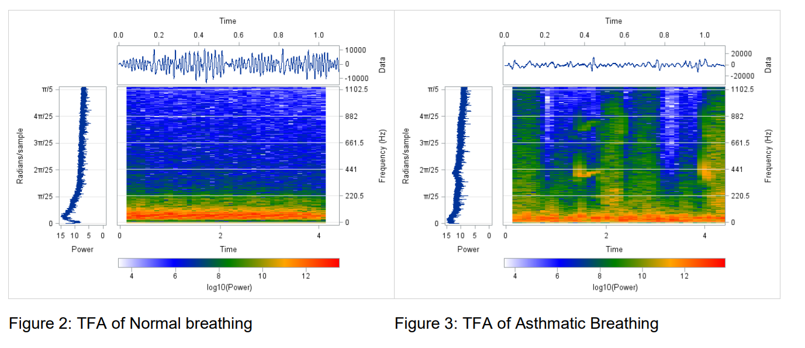
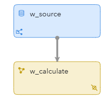
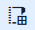
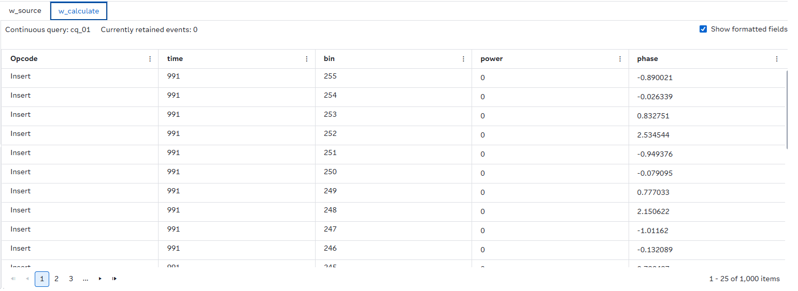
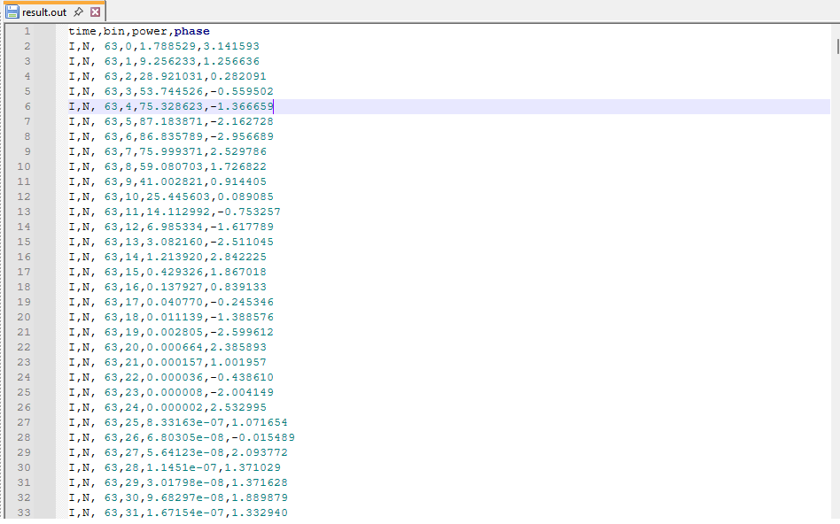

# Perform Short-Time Fourier Transform (STFT) on streaming data using SAS Event Stream Processing

## Overview

This example demonstrates how to use SAS Event Stream Processing to perform Short-Time Fourier Transform (STFT) analysis on streaming data. It includes a Source window that ingests signal samples and a Calculate window that computes STFTs on incoming data, publishing frequency-domain features such as power and phase.

For more information about how to install and use example projects, see [Using the Examples](https://github.com/sassoftware/esp-studio-examples#using-the-examples).

## Use Case

The project shows how to perform real-time spectral analysis on continuous signals. It is useful in the following scenarios:
- The signal data arrives continuously, and spectral features must be computed in real time.
- Time-varying frequency content needs to be monitored for anomalies or trends.
- Downstream applications require frequency-domain features for analysis or classification.

An example of a potential application is the detection of breathing patterns in healthcare:

For more details see [Time-Frequency Analysis Using SAS®](https://support.sas.com/resources/papers/proceedings17/SAS0585-2017.pdf)

## Source Data

The `input.csv` file is loaded through a File and Socket Connector in the Source window `w_source`. The stream of example data includes the following:
  - `ID`: Unique time identifier for each sample
  - `y`: Signal amplitude (value to be analyzed)

## Workflow

Here is a diagram of the project:

- **w_source**: A Source window that ingests example data from `input.csv` using a File and Socket connector.
- **w_calculate**: A Calculate window that applies the STFT algorithm to the incoming data and outputs spectral features to a file `result.out`.

### w_source

Explore the settings for the w_source window by doing the following steps:
1. Open the project in SAS Event Stream Processing Studio and select the `w_source` window.
2. Expand **Input Data (Publisher) Connectors**. Notice that the window is configured with a file and socket connector pointing to `input.csv`.
3. Expand **State and Event Type**. Notice that the project only accepts Insert events.
4. Click . Fields include:
   - `ID`: Primary key / time identifier
   - `y`: Signal value

### w_calculate

This window uses the STFT algorithm to compute frequency-domain features from the incoming signal.

Explore the settings for the `w_calculate` window by doing the following steps:
1. Select the `w_calculate` window.
2. Expand **Settings** and then expand **Parameters**.  

Parameters:
- `windowLength`: 64, Specifies the length of the sliding window. The value that you specify must be greater than the value you specify for overlap.
- `windowType`: 12, Specify one of the following window types: 1=Bartlett, 2=Bohman, 3=Chebyshev, 4=Gaussian, 5=Kaiser, 6=Parzen, 7=Rectangular, 10=Tukey, 11=Bartlett-Hann, 12=Blackman-Harris, 13=Blackman, 14=Hamming, 15=Hanning, and 16=Flat Top.
- `windowParam`: -1.0, (default value) Specifies the parameters for windowType. If not required for the window type selected, this value is ignored.
- `fftLength`: 256, Specifies the length to which windowed data should be expanded. Zeros are appended to the data before the Fast Fourier Transform (FFT) is performed. The specified value must be positive and at least as large as windowLength. A power of two is suggested to maximize computational efficiency.
- `overlap`: 32, Specifies the overlap between consecutive windows. Must be strictly less than windowLength. 
- `binsInSchema`: 256, Specifies the number of frequency bins to output. Must be less than or equal to fftLength. For real signals, bins greater than (fftLength/2) are not physically meaningful.

3. Expand **Input Map**.  
Input Map:
- `input`: `y` (Specifies the input variable by its name in the source schema. The Calculate window analyzes this variable.)  
- `timeId`: `ID` (Specifies the time ID variable name in the input stream. It must be uniformly spaced.)  

4. Expand **Output Map**.  
Output Map:
- `timeIdOut`: `time`, Specifies the time ID variable name in the output stream. There is more than one output event for a given time ID.
- `binOut`: `bin`, Specifies the frequency bin variable name in the output stream.
- `powerOut`: `power`, Specifies the name of the power variable in the output stream.  
- `phaseOut`: `phase`, Specifies the name of the phase variable in the output stream.  

The STFT results are written to an output file called `result.out`.

## Test the Project and View the Results

When you test the project in SAS Event Stream Processing Studio, the results for each window appear in separate tabs:

- **w_source**: Displays incoming signal samples
- **w_calculate**: Displays calculated spectral features (`power` and `phase`) for each frequency bin

Here is an example of the output in the `w_calculate` window:

Here is an example of the data in output `result.out` file:

## Next Steps

You can enhance this project by doing any of the following:
- Replace the CSV source with a live sensor/audio feed
- Add filters or aggregations before the STFT calculation
- Incorporate visualization tools (e.g., Grafana) to display time-frequency spectrograms
- Experiment with different STFT parameters (window type, length, overlap, FFT size) to optimize resolution

## Additional Resources

- [SAS Help Center: Calculating Short-Time Fourier Transforms](https://go.documentation.sas.com/doc/en/espcdc/v_063/espan/n1a24zmowg07opn1ul03ulh6g23c.htm#n0ghofy5wrzpvan1k24i6e45lcm7)
