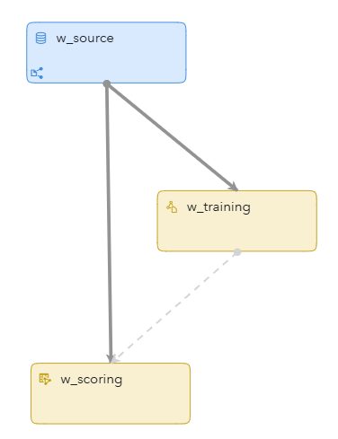
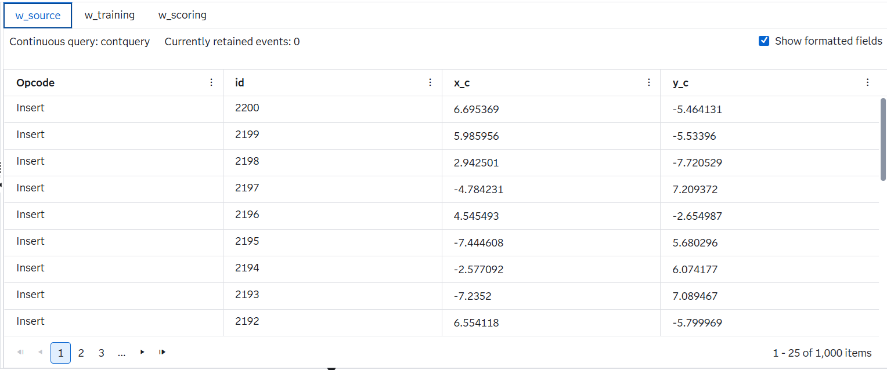
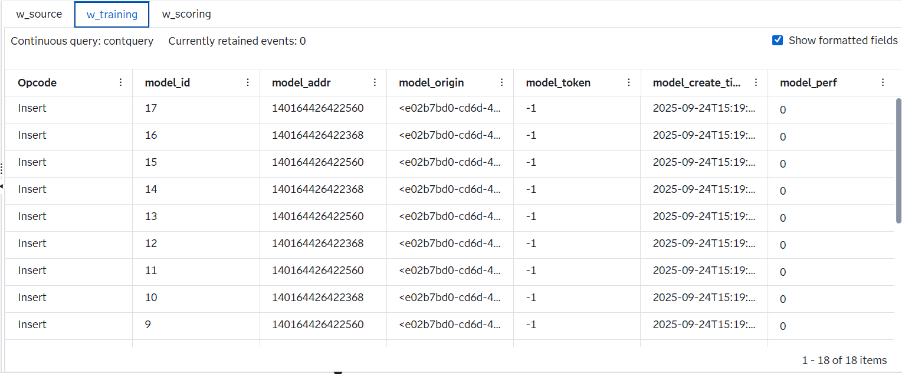
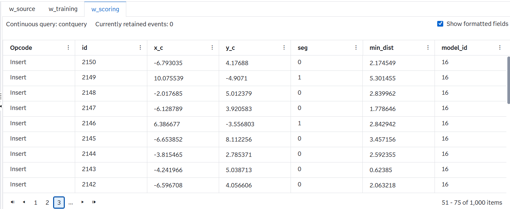

# Perform K-MEANS Clustering (K-MEANS) on Streaming Data Using SAS Event Stream Processing

## Overview
This example demonstrates the use of the machine learning algorithm K-means on streaming data. It includes a **Source window** that ingests signal samples, as well as **Train** and **Score** Windows that build the K-means model and assign each incoming event to its closest cluster in real time.
 
For more information about how to install and use example projects, see [Using the Examples](https://github.com/sassoftware/esp-studio-examples#using-the-examples).

## Use Case

This project demonstrates how to perform **real-time K-means clustering** on continuous event streams using SAS Event Stream Processing (ESP). Unlike traditional batch clustering, this approach updates clusters dynamically as new data arrives, making it ideal for environments where **milliseconds matter**.
It is useful in the following scenarios:
- **Anomaly Detection**:  
  Detect unusual behaviors in sensor data, financial transactions, or network traffic in real time.
- **Segmentation**:  
  Continuously group users, devices, or events into segments that update as behavior changes.
- **Pattern Recognition**:  
  Identify emerging patterns in fast-moving data such as IoT telemetry, clickstream activity, or fraud signals.

## How Streaming K-means Differs from Classic K-means

| Aspect | Classic K-means | Streaming K-means (SAS ESP) |
|--------|-----------------|------------------------------|
| **Data handling** | Works on a fixed dataset (batch mode). | Works on continuous incoming events (streaming). |
| **Iteration** | Repeats assignment + update steps until convergence. | No full re-iteration; clusters update incrementally with each batch. |
| **Centroid update** | Centroids are recalculated as the mean of all assigned points. | Centroids updated using a **damping factor**, giving more weight to recent data. |
| **Old data** | All points contribute equally, regardless of age. | Older points gradually lose influence (`dampingFactor`). |
| **Cluster dynamics** | Number of clusters fixed, centroids only move. | Clusters can **fade out** (`fadeOutFactor`) or **split** (`disturbFactor`). |
| **Use case** | Static datasets (e.g., customer segmentation at a single point in time). | Real-time adaptive clustering (e.g., IoT sensor streams, fraud detection, anomaly detection). |

## Source Data

The `events.csv` file is loaded through a File and Socket Connector in the Source window called `w_source`. The stream of example data includes the following:
  - `ID`: an event key
  - `x_c`: An x coordinate for the event
  - `y_c`: An y coordinate for the event
     
## Workflow
The following figure shows the diagram of the project:

The diagram is composed of the following components:  
- **w_source Source Window** – Ingests incoming signal samples (events) from the input file (events.csv).  
- **w_training Train Window** – Builds and continuously updates the K-means clustering model in real time.  
- **w_scoring Score Window** – Assigns each new event to the nearest cluster centroid and outputs the cluster ID along with distance metrics.  

### w_source
Explore the settings for the w_source window by doing the following steps:
1. Open the project in SAS Event Stream Processing Studio and select the w_source window.
2. Expand **Input Data (Publisher) Connectors**. Notice the file and socket connector called **events_Connector**.
3. Click . Notice that the **Fsname** points to `events.csv`.
4. Click **OK**.
5. Expand **State and Event Type**. Notice that the project accepts only Insert events.
6. Click . Fields include:
   - `id`: Primary key 
   - `x_c`: An x coordinate of data
   - `y_c`: An y coordinate of data

### w_training

This Train Window looks at all events and periodically generates a new clustering model using the k-means algorithm. Generated clustering model events are published to the `w_score` Window.

Open the project in SAS Event Stream Processing Studio and select the `w_training window`. In the right pane, in the **Settings** section, expand **Parameters**. Observe the following settings:
- `nClusters`: This parameter specifies the number of clusters.
- `initSeed`: This parameter specifies the random seed that is used during initialization when each point is assigned to a random cluster.
- `dampingFactor`: This parameter specifies the damping factor for old data points.
- `fadeOutFactor`: This parameter specifies the value for determining whether an existing cluster is fading out.
- `disturbFactor`: This parameter specifies the disturbance factor when splitting a cluster.
- `nInit`: This parameter specifies the number of data events that are used during initialization.
- `velocity`: This parameter specifies the number of events that arrive at a single timestamp.
- `commitInterval`: This parameter specifies the number of timestamps to elapse before committing a model to downstream scoring.

Expand the **Input Map** section. Observe that the `inputs` role specifies the variable names used in clustering: `x_c` and `y_c`.

### w_scoring

The events are scored in this Score window.

Select the w_scoring window. In the right pane, in the **Settings** section, expand **Streaming K-Means Clustering**. Observe the following settings:
- In the **Input Map** section, the `inputs` role specifies the variable names used in clustering: `x_c` and `y_c`.
- In the **Output Map** section, observe the following settings:
  - The `labelOut` role specifies the output variable name that stores the cluster label. The variable name is `seg`. 
  - The `minDistanceOut` role specifies the output variable name that stores the distance to the nearest cluster. The variable name is `minDist`. 
  - The `modelIdOut` role specifies the output variable name that stores the ID of the model from which the score is computed. The variable name is `model_id`.

## Test the Project and View the Results

When you test the project in SAS Event Stream Processing Studio, the results for each window appear on separate tabs in test mode. 
The **w_source** tab displays events to be scored:

The **w_training** tab displays the generated clustering model using the k-means algorithm:

The **w_scoring** tab displays the scored events:

You might see warnings in the Log pane about the w_source window being throttled. You can ignore these warnings.

## Next Steps

You can enhance this project by doing any of the following:
- Replace the CSV source with a live sensor feed
- Experiment with different K-means training parameters to optimize clustering resolution

## Additional Resources

For more information, see [SAS Help Center: Training and Scoring with K-means Clustering](https://go.documentation.sas.com/doc/en/espcdc/v_064/espan/p1cvplf50cug5jn1mz8b5qrq6q36.htm#p01ejm2939294pn1jxmoiqqoh21q).

