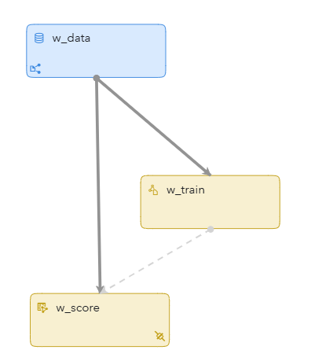
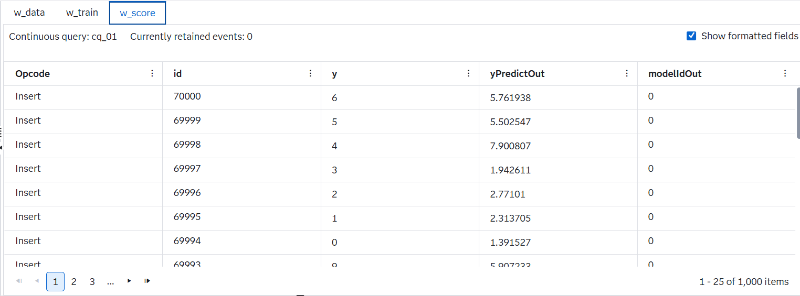

# Online Linear Regression on Streaming Data

## Overview

This example demonstrates how you can use **SAS Event Stream Processing** to build and continuously update a **linear regression model** on a high-dimensional stream of data in real time. It includes a source window that ingests streaming data, a training window that updates a regression model, and a scoring window that applies the model to incoming data points.

---
**NOTE:**  
Use this example with **SAS Event Stream Processing 2024.01** and later.

For more information about how to install and use example projects, see [Using the Examples](https://github.com/sassoftware/esp-studio-examples#using-the-examples).

## Use Case

The project illustrates how to perform **online training and scoring** using linear regression on incoming data streams. It is useful in scenarios where:
- Data arrives continuously and training must be performed in real time.
- The data includes a very high number of features (784 in this case).
- Continuous updates to the model are required without retraining from scratch.

## Source Data and Other Files

- The source window uses a file connector to ingest a stream of synthetic data that includes:
  - `id`: Unique identifier
  - `y`: Target response variable
  - `x1` to `x784`: Input features
- Output predictions are saved to a CSV file: `result.out`

## Prerequisites

There are no special prerequisites for this example. It uses standard components of SAS Event Stream Processing and runs in both local and edge server environments.

## Workflow

The following figure shows the diagram of the project:

- **w_data**: A **Source** window that ingests example data from a CSV file using the `fs` (file socket) connector.
- **w_train**: A **Train** window that performs online linear regression, generating updated models as new data arrives.
- **w_score**: A **Score** window that uses the current model to compute predictions on streaming data.

### w_data

Explore the settings for the `w_data` window:
1. Open the project in SAS Event Stream Processing Studio and select the `w_data` window.
2. Expand **Settings**.
3. Observe that the window is configured with a file connector and is insert-only.
4. Click . Fields include:
   - `id`: Primary key
   - `y`: Target variable
   - `x1`–`x784`: Predictor variables

### w_train

This window uses the **LinearRegression** algorithm and periodically updates the model using incoming data.

Explore the settings:
- `nInit`: `60000` (Number of events for initialization)
- `commitInterval`: Model update frequency
- `dampingFactor`: Controls the influence of older data
- `centerFlag` / `scaleFlag`: Enable centering and scaling of dense data

Field descriptions:
- `inputs`: `x1`–`x784`
- `target`: `y`

### w_score

Scores data using the model from `w_train`.

**Input settings:**
- `inputs`: Same 784 features
- `yPredictOut`: Field for predicted `y`
- `modelIdOut`: Model version used for prediction

Output fields:
- `id`
- `y`
- `yPredictOut`
- `modelIdOut`

The scoring results are written to `result.out`.

## Test the Project and View the Results

When you test the project in SAS Event Stream Processing Studio, the results for each window appear in separate tabs:

- **w_data**: Displays incoming data.
- **w_train**: Displays model commit activity.
- **w_score**: Displays predictions (`yPredictOut`) and associated model IDs (`modelIdOut`).

The following figure shows the results in the scoring window:

## Next Steps

You can enhance this project by:
- Replacing the CSV source with a live sensor feed.
- Adding filters or aggregations before training.
- Incorporating Grafana to visualize predicted vs actual values over time.
- Experimenting with different feature sets or preprocessing methods.

## Additional Resources

- [SAS Help Center: Training and Scoring with Streaming Linear Regression](https://go.documentation.sas.com/doc/en/espcdc/v_062/espan/p07btvrqyc27h0n106jmlsrfj053.htm#p0vhvkecejjsgkn1r6oxe1446bde)
