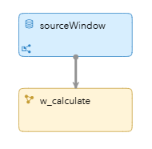
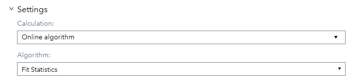
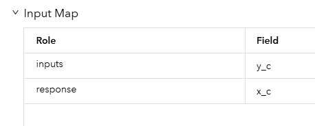
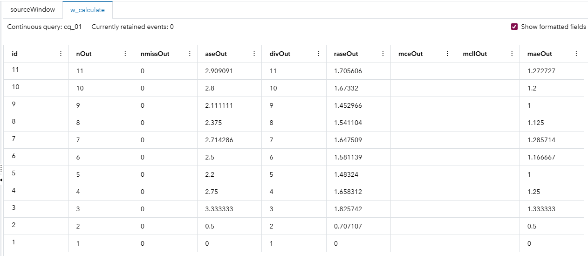

# FitStat in SAS Event Stream Processing (ESP)

## Overview

The FitStat capability in **SAS Event Stream Processing (ESP)** is not exposed as a standard window in the ESP Studio graphical user interface like Pattern, Calculate, or Filter windows. Instead, FitStat is a **function inside the Calculate window** and is specifically associated with **model scoring windows** when working with analytics models like logistic regression, decision trees, or neural networks.

### Where You Encounter FitStat in ESP

- **Calculate Window**  
  You can invoke FitStat as an algorithm within a Calculate window to compute error metrics on predictions flowing through the stream.

  

---

## Source

The [input-fitstat.csv](input-fitstat.csv) file contains a list predicted values and ground truth values.

- `inputs="y_c"`: The **predicted values** from your model (y_hat equivalent).
- `response="x_c"`: The **actual observed target values** (ground truth).

FitStat will compare — predictions vs. actuals.

---

## Workflow

The following figure shows the diagram of the project: 

	

- The source window takes predicted (`y_c`) and actual (`x_c`) values from a stream.
- The Calculate window receives data events from the Source window. It publishes goodness-of-fit statistics according to the FitStat algorithm's properties.

### w_calculate

In the Calculate window used in this model, the FitStat algorithm is defined as an Online algorithm field in the settings:

	

along with the input-map properties and output-map properties. For input variables in regression models, only one input variable is required. This input variable specifies the predicted response. For classification models, the variables must be listed and must contain the predicted probabilities for each class.  For this project we have the following inputs:

	

In this example, the data from the source window is from a regression model.  In addition, the response variable specifies the target variable. The following output-map properties are also defined:

| Field    | Description                               |
| -------- | ----------------------------------------- |
| nOut     | Number of observations (N)                |
| nmissOut | Number of missing values                  |
| aseOut   | Average squared error (ASE)               |
| divOut   | Divisor used for ASE                      |
| raseOut  | Root ASE                                  |
| mceOut   | Mean consequential error (classification) |
| mcllOut  | Multiclass log loss (classification)      |
| maeOut   | Mean absolute error                       |
| rmaeOut  | Root mean absolute error                  |
| msleOut  | Mean squared logarithmic error            |
| rmsleOut | Root MSLE                                 |

As the data from the Source window is from a regression model, the variables mceOut and mcllOut appear as blank in the resulting output.

## Test the Project and View the Results

When you test the project, the results for each window appear on separate tabs.  The w_calculate shows the results from the FitStat algorithm.

- The source tab shows the  predicted (`y_c`) and actual (`x_c`) values from a stream.
- Fit statistics are calculated like nmissOut (Number of missing values), maeOut (Mean absolute error) and others in real-time as data flows through.
- Outputs these stats as part of the event stream, where downstream windows or consumers can pick them up for monitoring, alerts, or dashboards.

## Why Use FitStat in ESP?

- **Live Model Monitoring:** See if model accuracy is degrading in production.
- **Streaming Validation:** Detect data drift or issues without batch jobs.
- **Alerts:** Trigger automated actions when errors cross a threshold.

## Additional Resources

This is an undocumented secret feature of ESP.  It is best to not use it and just do batch monitoring in Model Manager instead. 
