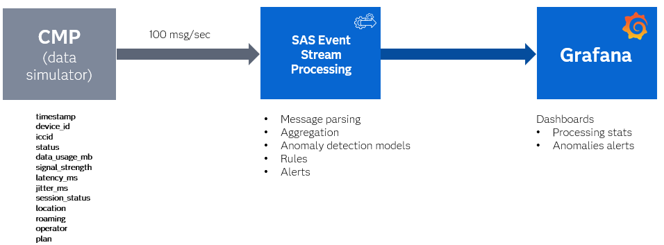
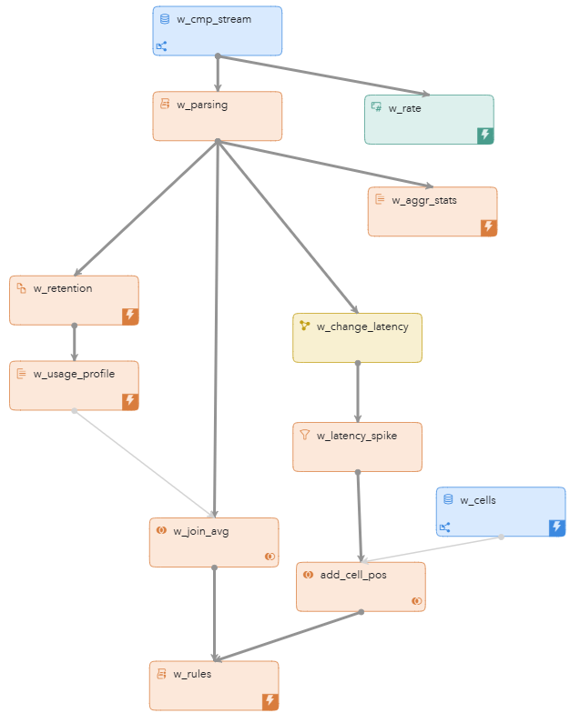
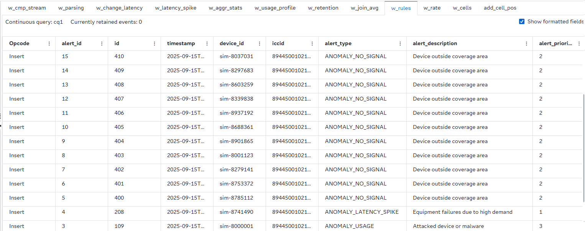
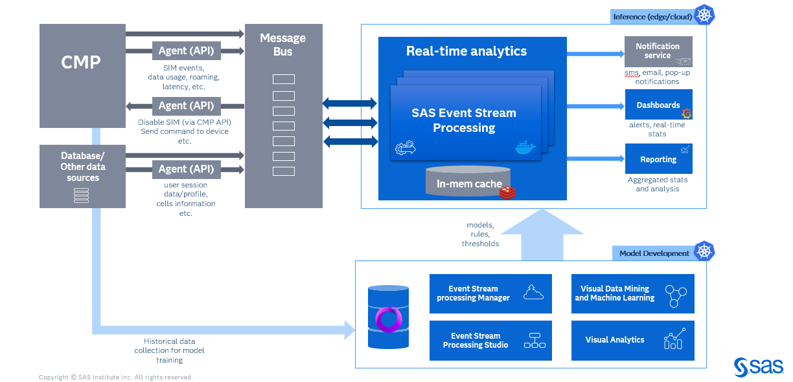
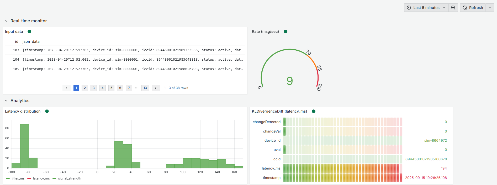
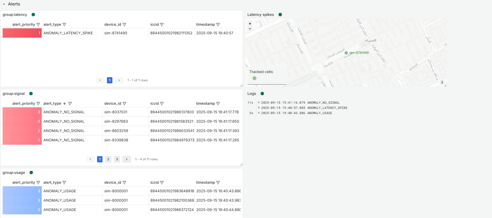

# Connectivity Analytics for Telemetry Data in Telecom Networks

## Overview

This example demonstrates how to use SAS Event Stream Processing to analyze telemetry data from a Connectivity Management Platform (CMP). Telemetry data refers to the automated collection and transmission between devices over a network without human invervention. The Connectivity Management Platform is a cloud-based system that manages the Internet of Things (IoT) and machine-to-machine (M2M) device connectivity. The CMP also manages subscriber identity modules (SIM) and data usage.
For more information about how to install and use example projects, see [Using the Examples](https://github.com/sassoftware/esp-studio-examples#using-the-examples).

## Use Case

This example shows different approaches for monitoring CMP data. Three event samples use synthetic data, and for each sample, a specific stream processing technique is applied:
- Device outside coverage area (for example, tunnel): events are detected using processing rules on streaming event data.
- Attacked device or malware: detection is based on rules applied to aggregated data within a specific time frame.
- Equipment failures due to high demand: change detection using the Kullback–Leibler (KL) Divergence approach is applied.

## Source Data and Other Files

- The source window uses a file and socket connector to ingest a stream of synthetic data from an input file called `anomalies.csv` that includes:

  - `timestamp`: Unique identifier
  - `device_id`: Unique device identifier
  - `iccid`: Unique network cell identifier
  - `status`: Device status
  - `data_usage_mb`: Device network traffic usage
  - `signal_strength`: Device connection signal strength
  - `latency_ms`: Latency in microseconds in receiving or sending network packages
  - `jitter_ms`: Variation in latency over time
  - `session_status`: Connection session status for the currently registered network
  - `location`: Country name of the device home region
  - `roaming`: If current region is home region for the device
  - `operator`: Network provider where device currently registered
  - `plan`: Network provider tariff
<!-- please add one or two sentence describing the diagram below -->


## Workflow

The following figure shows the diagram of the project:



- w_cmp_stream: A Source window that receives synthetic CMP data from the file. 
- w_parsing: A Lua window that applies standard JSON message parsing using the **esp_parseJsonFrom** function.
- w_retention: A Copy window that applies a data retention policy of four days.
- w_usage_profile: An Aggregate window that aggregates average data usage for each device ID and indicates whether a device is roaming.
- w_join_avg: A Join window that joins back current average values to the Input event as a new field.
- w_change_latency: A Calculate window that detects anomalies in latency data from CMP. The supported algorithms are based on the Kullback–Leibler (KL) Divergence approach. 
- w_latency_spike: A Filter window that filters out events and keeps only the events where `changeDetected` is equal one.
- w_cells: A Source window that reads latitude and longitude data for `cell_id`.
- add_cell_pos: A Join window that joins back the values from w_cells to the Input event.
- w_rules: A Lua window that implements alert generation logic.
- w_rate: A Counter window that... 
- w_copy: A Copy window that...
- w_aggr_stats: An Aggregate window that...  
<!-- fill in missing information above please -->
### w_cmp_stream
<!-- Is there anything in the settings of this window you want the user to explore? If not, I recommend removing this window section all together -->
Receives synthetic CMP data from the file; the message data is written to json_data text field in JSON format. <!-- is message data the same as output data? -->

### w_parsing

Explore the settings for the w_parsing window:
1. Open the project in SAS Event Stream Processing Studio and select the w_parsing window.
2. In the right pane, expand **Lua Settings**.
3. Under **Code source**, you will see the following window of code:

```lua
function create(data,context)
    local   message_info = esp_parseJsonFrom("json_data")
    if message_info == nil then
        print("ERROR: Failed to parse message")
        return {}
    end
    local   e = {}
    e.timestamp = esp_getSystemMicro()
    e.device_id = message_info.device_id
    e.iccid = message_info.iccid
    e.status = message_info.status
    e.data_usage_mb = message_info.data_usage_mb
    e.signal_strength = message_info.signal_strength
    e.latency_ms = message_info.latency_ms
    e.jitter_ms = message_info.jitter_ms
    e.session_status = message_info.session_status
    e.location = message_info.location
    e.roaming = message_info.roaming
    e.operator = message_info.operator
    e.plan = message_info.plan
    return(e)
end
```
<!-- ok so what is the significance of this code? Does this code the logic of the function that is applied in this window? Try to write a sentence or two here explaining. -->
### w_retention, w_usage_profile, and w_join_avg

These three windows use a standard design pattern to enrich incoming events with aggregated information.
1. The w_retention window applies data retention for the last four days.
2. The w_usage_profile window aggregates average data usage from the `data_usage_mb` field for each `device_id` field. This window also uses the `roaming` field to consider whether the device is roaming or not.
3. The w_join_avg windows joins each current average value back to the Input event as a new field called `data_usage_avg_mb`.
<!-- is there anything you want to point out in the settings of these windows? right now the descriptions are redundant of the ones I have in the workflow section. -->

### w_change_latency

This windows identifies sudden or unexpected deviations in a time series or data stream. It uses the KLDivergenceDiff measure which is pictured directly below: <!-- is this correct? -->
<p align="center"></p>

For more details, refer to [SAS Help Center: Change Detection](https://go.documentation.sas.com/doc/en/espcdc/v_063/espan/n0jveogr5iwzyxn1w7imhj73d4zf.htm).

Explore the setting for the w_change_latency window:
1. Open the project in SAS Event Stream Processing Studio and select the w_change_latency window.
2. Expand **Settings** and then expand **Parameters**. See the following parameters:  
    - `slidingAlpha`: Specifies the fading factor for the sliding window. The value range is 0<α<=1, and the default value is **0.98**.
    - `slidingHalfLifeSteps`: Specifies the number of steps at which the weight of the input reaches half of its original weight for the sliding window. The default value is **0**.
    - `refWindowSize`: Specifies the size of the reference window. The default value is **100**.
    - `changeThreshold`: Specifies the threshold that determines whether a change occurred. The default value is **0.2**. 
    - `nBins`: Specifies the maximum number of bins in the histogram for reference and sliding windows. This value also determines the number of bins when computing KL divergence. The default value is **50**. 
    - `maxEvalSteps`: Specifies the maximum number of steps before performing a new evaluation. The default value is **100**.
    - `adaptiveEval`: Specifies whether to use the adaptive evaluation step size or not. The default value is **1** which means the adaptive evaluation step size is used. <!-- I'm guessing 1 is yes and 0 is no? Like binary? -->
    - `measure`: Specifies the measure used to compare the data streams from the reference window and from the sliding window. The default value is **KLDivergenceDiff**.
    - `showEval`: Specifies whether to show evaluation events regardless of whether a change is detected. The default value is **1** which means evaluation events are shown. <!-- fact check this please -->
    - `showAll`: Specifies whether to show all events, regardless of whether an evaluation occurs. The default value is **1** which means all events are shown. <!-- same here -->
      
3. Expand **Input Map**.  
    - `input`: Specifies the input variable for change detection. In this example, it analyzes **latency_ms** which is the registered signal latency.
      
4. Expand **Output Map**.  
    - `evaluatedOut`: Specifies the name of the output variable that indicates whether an evaluation occurred. <!-- how does "eval" factor in? -->
    - `changeValueOut`: Specifies the name of the output variable that contains the change value.  <!-- how does "changeVal" factor in? -->
    - `changeDetectedOut`: Specifies the name of the output variable that indicates whether a change has been detected. This variable is used in the `w_latency_spike` window.  <!-- how does "changeDetected" factor in? -->
      
### w_latency_spike
<!-- Is there anything in the settings of this window you want the user to explore? If not, I recommend removing this window section all together -->

Explore the setting for the w_latency_spike window:
1. Open the project in SAS Event Stream Processing Studio and select the w_latency_spike window.
2. In the right pane, expand **Filter**.
3. Under **Code source**, you will see the following window of code:

```lua
function filter(event,context)
    return (event.changeDetected==1)
end
```
This code filters out events and keeps the ones where `changeDetected` is equal to one.

### w_cells and add_cell_pos

These two windows... <!-- fill this in with an explanation of how they work together -->
1. The w_cells window reads latitude and longitude data for `cell_id`.
2. The add_cell_pos window joins these values back to the Input event as fields called `cell_id_lat` and `cell_id_lon`.

### w_rules

There are three types of alerts: ANOMALY_NO_SIGNAL, ANOMALY_USAGE, and ANOMALY_LATENCY_SPIKE. The ANOMALY_NO_SINGAL alert means the device is outside the coverage area. The ANOMALY_USAGE alert means the device is being attacked or there is malware. The ANOMALY_LATENCY_SPICE alert means there are equipment failures due to high demand. This Lua window applies alert generation logic to Input event fields, aggregated fields, and events where change is detected by the analytics algorithm. 

Explore the setting for the w_rules window:
1. Open the project in SAS Event Stream Processing Studio and select the w_rules window.
2. In the right pane, expand **Lua Settings**.
3. Under **Code source**, you will see the following window of code:
   
```lua
local alert_id = 1
function create(data,context)
    local   alerts = {}
    local array_idx = 1
    -- Monitoring rules --
    -- RULE 1: zero data, no signal
    if context.input=="w_join_avg" and data.session_status == "dropped" and data.status == "inactive" and data.data_usage_mb == 0.0 then
        local alert = {}
        alert.alert_id = alert_id
        alert.id = data.id
        alert.timestamp = data.timestamp
        alert.device_id = data.device_id
        alert.iccid = data.iccid
        alert.alert_type = esp_toString("ANOMALY_NO_SIGNAL")
        alert.alert_description = esp_toString("Device outside coverage area")
        alert.alert_priority = 2
        alert.cell_id_lat =  0
        alert.cell_id_lon = 0
        alerts[array_idx] = alert
        alert_id = alert_id + 1
        array_idx = array_idx + 1
    end
    -- RULE 2: unusual high traffic consumption
    if context.input=="w_join_avg" and ((data.data_usage_mb -  data.data_usage_avg_mb)>1000) and (data.data_usage_mb ~= 0)   then
        local alert = {}
        alert.alert_id = alert_id
        alert.id = data.id
        alert.timestamp = data.timestamp
        alert.device_id = data.device_id
        alert.iccid = data.iccid
        alert.alert_type = esp_toString("ANOMALY_USAGE")
        alert.alert_description = esp_toString("Attacked device or malware")
        alert.alert_priority = 3
        alert.cell_id_lat =  0
        alert.cell_id_lon = 0
        alerts[array_idx] = alert
        alert_id = alert_id + 1
        array_idx = array_idx + 1
    
    end
    
    -- Detected anomalies --
    -- higher latency, jitter, dropped session
    if context.input == "add_cell_pos" and data.changeDetected==1  then

        local alert = {}
        alert.alert_id = alert_id
        alert.id = data.id
        alert.timestamp = data.timestamp
        alert.device_id = data.device_id
        alert.iccid = data.iccid
        alert.alert_type = esp_toString("ANOMALY_LATENCY_SPIKE")
        alert.alert_description = esp_toString("Equipment failures due to high demand")
        alert.alert_priority = 1
        alert.cell_id_lat =  24.7743 + math.random(0, 1)/100
        alert.cell_id_lon = 46.7386 + math.random(0, 1)/100
        alerts[array_idx] = alert
        alert_id = alert_id + 1
        array_idx = array_idx + 1
    end
    if array_idx > 1 then
        return(alerts)
    else 
        return false
    end
end
```
This code is the alert generation logic used to create alerts.

### w_rate, w_copy, and w_aggr_stats
<!-- Is there anything in the settings of this window you want the user to explore? If not, I recommend removing this window section all together -->
These windows collect aggregated data for Grafana dashboards.
1. The w_rate window...
2. The w_copy window...
3. The w_aggr_stats window...
<!-- fill in each window's role in this process and how each one contributes to collecting aggregated data -->

## Test the Project and View the Results
When you test the project, the results appear on separate tabs. The following figure shows the results for the w_rules tab:  

<!-- are there any other windows you want to show screenshots of? -->

## High level target solution architecture
Here is an example of a possible general architecture for a CMP data analysis system using SAS Event Stream Processing:  

<!-- this feels out of place. Could this go somewhere else? Not sure it's even necessary to include. -->

## Next Steps

Alerts, model performance, and streaming data can be visualized using the [SAS Event Stream Processing Data Source Plug-in for Grafana](https://github.com/sassoftware/grafana-esp-plugin). Import [grafana.json](grafana.json) to a dashboard in Grafana. <!-- reworded. is this correct? --> The following figure shows an example of a Grafana dashboard:




#### Real-Time Monitor Panel
- **Input Data Table** – Displays CMP events (Uses data from ESP Window `w_cmp_stream`).
- **Rate Gauge** – Shows the events processing rate (`w_rate`). 
#### Analytic Panel
- **Latency distribution histogram** – Displays distribution of jitter_ms, latency_ms and signal_strength (`w_aggr_stats`).
- **KLDivergenceDiff bargauge** - Displays model evaluation (`w_change_latency`).
  


#### Alerts Panel
- **group:latency table** – Displays alerts on changes in latency pattern, indicating possible equipment failures due to high demand (`w_rules`).
- **group:signal table** - Displays no signal alerts when a device is outside the coverage area (`w_rules`).
- **group:usage table** – Displays unusual traffic usage pattern alerts when a device probably has malware (`w_rules`).
- **Latency spikes geomap** - Shows the location of devices where latency anomalies are detected (`w_rules`).
- **Logs** – Displays aggregated alert data by alert type (`w_rules`).

[Grafana video](grafana.mp4)

---
**NOTE:**
This dashboard was created using standalone SAS Event Stream Processing, running in the same namespace as Grafana. If you are using a different environment, such as the SAS Viya platform, you must recreate the queries because the connection URLs will differ.

---


You can enhance this project by:
- Replacing the CSV source with a live sensor feed.
- Adjusting rules logic for new types of anomalies which observed in the input stream.
- Using other change detection methods in the Calculate window to improve detection accuracy where required by the input data.


## Additional Resources

- [SAS Help Center: Change Detection](https://go.documentation.sas.com/doc/en/espcdc/v_063/espan/n0jveogr5iwzyxn1w7imhj73d4zf.htm#p0fydwd77vhobwn1c4c89qbv6r7f)
