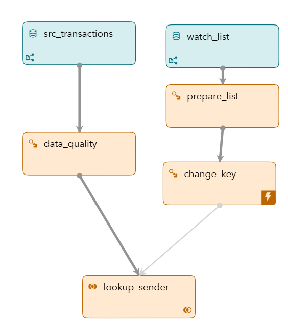
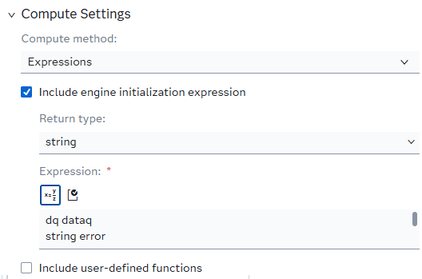
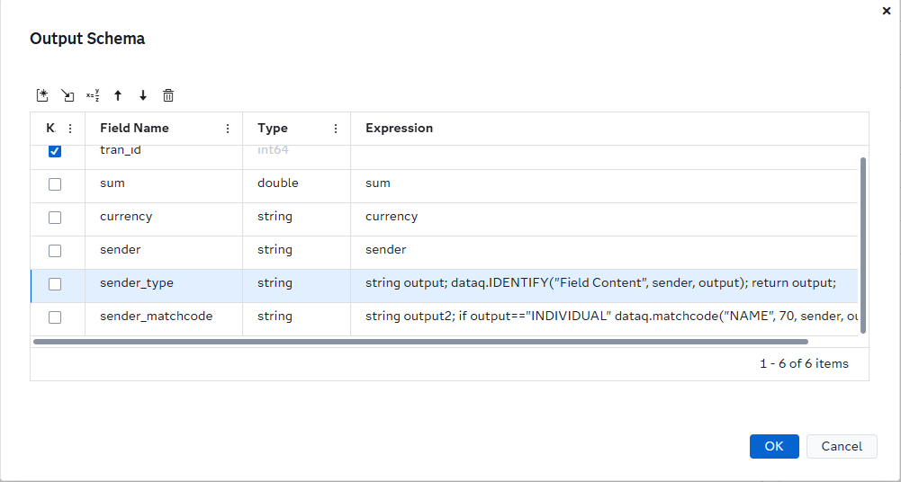
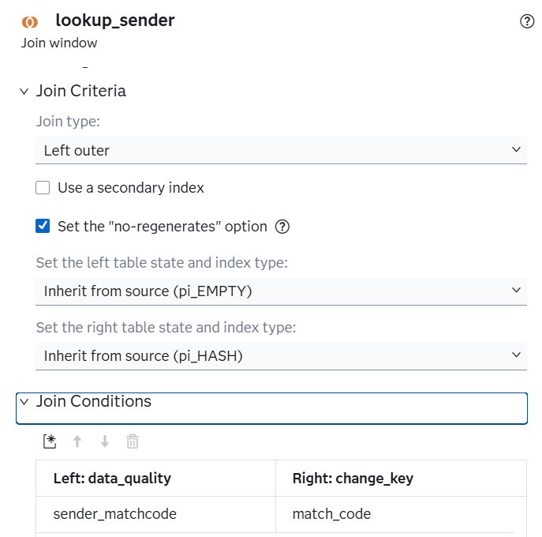
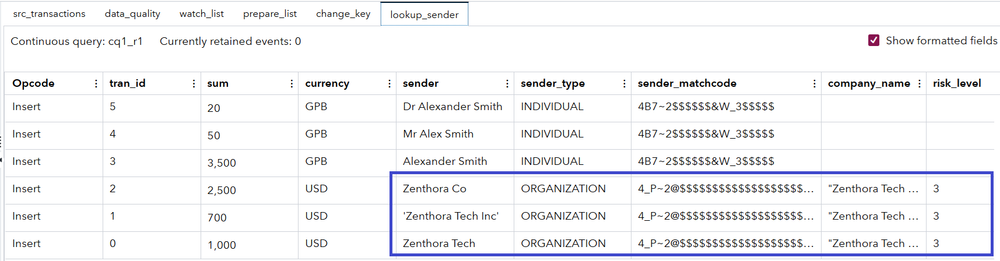

# Fuzzy Lookup of Organization names in transactions using SAS Data Quality

## Overview

This example demonstrates how to use **SAS Event Stream Processing (ESP)** to perform fuzzy lookups on streaming data using **SAS Data Quality**.

It includes examples of:
- EEL syntax to load the Quality Knowledge Base (QKB)
- Building match codes
- Performing lookups using an ESP Join Window
---
**NOTE:**  
Use this example with **SAS Event Stream Processing 2024.01** and later.
For more information about how to install and use example projects, see [Using the Examples](https://github.com/sassoftware/esp-studio-examples#using-the-examples).

## Use Case

This project illustrates how to perform **watch list screening** on transaction data using fuzzy matching.

The workflow includes:
- Loading the watch list
- Preparing match codes from the watch list
- Ingesting transactional data
- Generating match codes for the `sender` field in transactions
- Matching the transaction `sender` against the watch list
- Retrieving and assigning the corresponding **risk score** based on the matched entity

## Source Data and Other Files

- The source window named `watch_list` uses the **Lua connector** to ingest synthetic data records with the following fields:
  - `company_name`: The registered name of the company
  - `risk_level`: An integer indicating the associated risk level

- The source window named `src_transactions` also uses the **Lua connector** to ingest synthetic transaction records with the following fields:
  - `tran_id`: A unique card transaction ID
  - `sum`: The transaction amount
  - `currency`: The transaction currency
  - `sender`: The sender's name — which may be an individual or an organization, with various spelling formats

## Prerequisites

This example requires **SAS Data Quality** to be installed and two environment variables to be configured in **ESP Studio**:

- `DFESP_QKB`: Set this to the shared folder under the SAS Data Quality installation.  
  On Linux systems, this typically looks like:  
  `/QKB/data/ci/<qkb_version_number>`  
  For example: `/QKB/data/ci/22`

- `DFESP_QKB_LIC`: Set this to the full path of the SAS Data Quality license file.

For more details, refer to the official SAS documentation:  
🔗 [Setting Up SAS Data Quality in ESP](https://documentation.sas.com/doc/en/espcdc/v_062/espcreatewindows/n19ijp61ldn7vrn10czlree4uqir.htm)


## Workflow

The following figure shows the diagram of the project:



- **src_transactions**: A **Source** window that ingests synthetic transaction data using the Lua connector.
- **watch_list**: A **Source** window that ingests synthetic watch list data using the Lua connector.
- **data_quality**: A **Compute** window that loads data quality functions from the QKB and performs identification and matchcode generation for the sender name.
- **prepare_list**: A **Compute** window that loads data quality functions from the QKB and performs identification and matchcode generation for watch list items.
- **change_key**: A **Compute** window that modifies the primary key of each event to enable use in a **Left Join** operation.
- **lookup_sender**: A **Join** window that performs a fuzzy lookup by matching the sender’s matchcode from the transaction stream against the watch list.


### data\_quality

The `data_quality` **Compute window** is responsible for initializing the SAS Quality Knowledge Base (QKB) and applying data quality functions for entity identification and matchcode generation.

#### Initialization

An initializer block is used to set up the QKB and load the appropriate locale. In this example, the locale is set to **US English** (`ENUSA`):



```xml
dq dataq
string error
dataq = DQ_INITIALIZE()
print("DQ init value:" & dataq)
error=dataq.LOADQKB("ENUSA")
print("DQ locale read:" & error)
```

Once initialized, QKB-based data quality functions are available for use in field expressions.

#### Entity Type Detection

The first step is to identify whether the `sender` is an **individual** or an **organization** using the `IDENTIFY` function:



```EEL
string output;
dataq.IDENTIFY("Field Content", sender, output);
return output;
```

#### Matchcode Generation

Based on the entity type, the appropriate **matchcode** is generated using either the `NAME` or `ORGANIZATION` context with a sensitivity level of `65`:

```EEL
string output2;
if output=="INDIVIDUAL"   
dataq.matchcode("NAME", 65, sender, output2);
else 
dataq.matchcode("ORGANIZATION", 65, sender, output2);
return output2;
```

A **matchcode** is a standardized textual representation of a name or organization that enables fuzzy matching. It accounts for variations in spelling, abbreviations, and common prefixes/suffixes.

#### Example

| Input Name         | Matchcode                         |
| ------------------ | --------------------------------- |
| Mr Alex Smith      | 4B7\~2\$\$\$\$\$\$&W\_3\$\$\$\$\$ |
| Dr Alexander Smith | 4B7\~2\$\$\$\$\$\$&W\_3\$\$\$\$\$ |

As shown, the matchcode function standardizes the input, allowing both forms of the name to be treated as equivalent.

### prepare\_list

The `prepare_list` **Compute window** is responsible for initializing the SAS Quality Knowledge Base (QKB) and generating matchcodes for the `company_name` field in the watch list.

```EEL
string output_mc;
dataq.matchcode("ORGANIZATION", 65, company_name, output_mc);
return output_mc;
```

### lookup\_sender

The `lookup_sender` **Join window** performs a left join between the transactions and the watch list using the matchcode key.



## Test the Project and View the Results

When you test the project in **SAS Event Stream Processing Studio**, the results of the fuzzy lookup will appear in the `lookup_sender` window tab:



As shown above, the system successfully matches the `sender` organization name with the watch list entry, even when different spellings are used. This demonstrates the effectiveness of using match codes for fuzzy matching.


## Next Steps

You can enhance this project by:

- **Incorporating additional Data Quality functions**, such as:
  - `DQ.CASE`
  - `DQ.EXTRACT`
  - `DQ.GENDER`
  - `DQ.PARSE`
  - `DQ.PATTERN`
  - `DQ.STANDARDIZE`
  - `DQ.TOKEN`

  Refer to the full list of supported functions in the SAS documentation:  
  🔗 [SAS Data Quality Functions in ESP](https://documentation.sas.com/doc/en/espcdc/v_062/espcreatewindows/n0qr20xa01a5kcn1kvk185dzgnpt.htm)
- **Applying additional business rules** on transaction data, beyond watch list matching. For example, flag high-value transactions or unusual currency usage.
- **Experimenting with different matchcode sensitivities** in the `DQ.MATCHCODE` method to fine-tune the balance between false positives and false negatives.


## Additional Resources

- [SAS Help Center: Using Expression Engine Language (EEL)](https://documentation.sas.com/doc/en/espcdc/v_062/espcreatewindows/n19ijp61ldn7vrn10czlree4uqir.htm)
- [SAS Help Center: Quality Knowledge Base: User Guide:QKB Definition Types](https://go.documentation.sas.com/doc/en/sasadmincdc/v_067/qkb/p0013v6doxf8f1n12w81udna30gm.htm)
