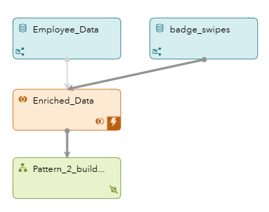
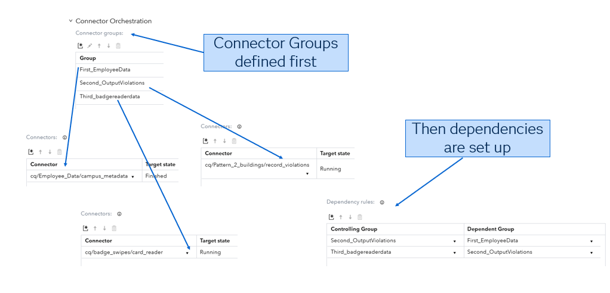
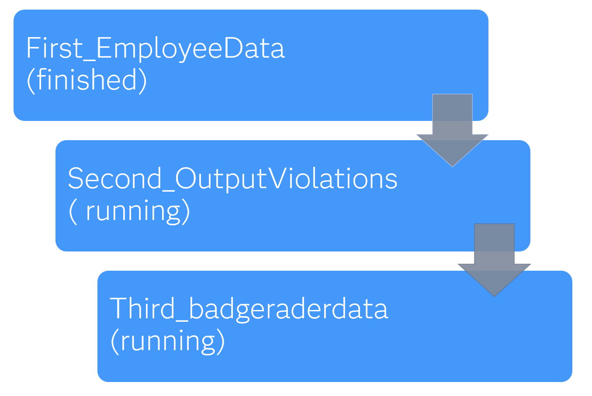
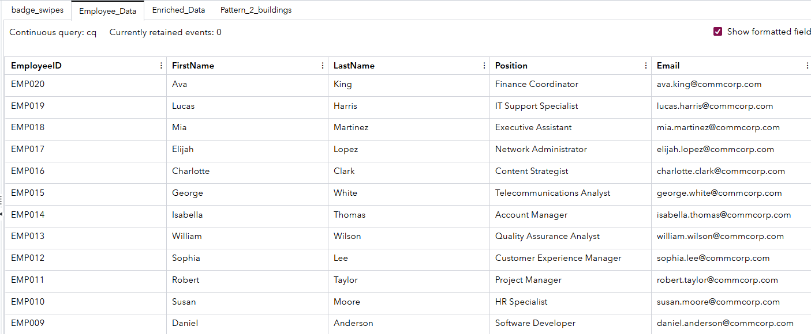
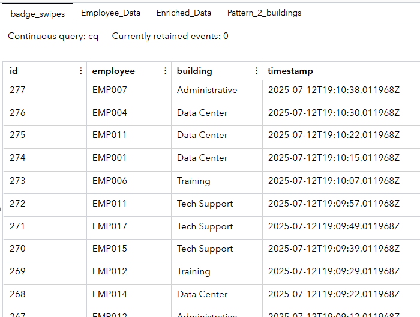
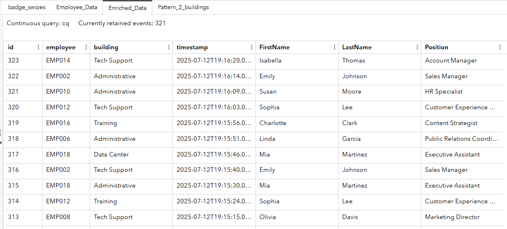
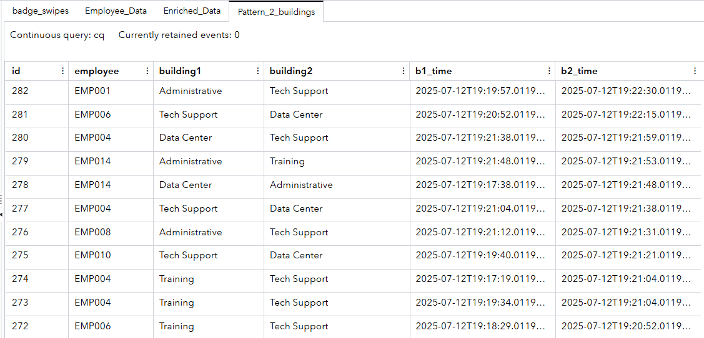
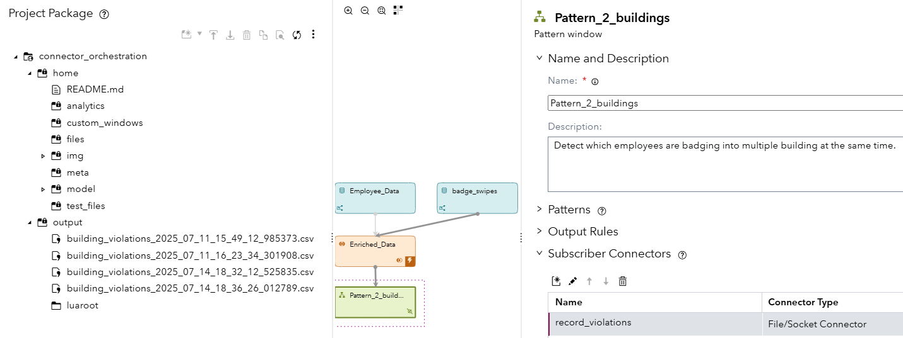

## How Does Connector Orchestration Work with ESP Connectors?

### Overview

This SAS Event Stream Processing (ESP) project demonstrates **connector orchestration**—a feature that controls the sequence and state of connector execution. The goal of this project is to detect suspicious badge swipe behavior, such as employees badging into multiple buildings within a short time span. It simulates real-time badge swipes, enriches them with employee metadata, and detects anomalies using pattern windows. Importantly, the project uses connector orchestration to ensure that data ingestion and output operations happen in a logical and controlled sequence.

### Source Data

There are two primary data sources in this project:

- **Employee Data**: Static reference data about employees (name, position, etc.) published via a Python connector. This acts as metadata for enriching swipe data.
- **Badge Swipes**: Simulated streaming data representing badge swipes at different buildings, generated using a Python-based publisher that emits random events over time.

The project assumes badge swipe data will be enriched with employee info before being used for pattern detection.

### Workflow

The streaming project consists of the following windows:

1. Employee_Data (Source Window)
    Ingests static employee records using a Python connector named campus_metadata.
2. badge_swipes (Source Window)
    Ingests simulated streaming badge swipe events using a Python connector named card_reader.
3. Enriched_Data (Join Window)
    Performs a left outer join of badge_swipes with Employee_Data on employee ID, combining real-time badge activity with descriptive metadata.
4. Pattern_2_buildings (Pattern Window)
    Detects cases where an employee badged into two different buildings within five minutes—indicating suspicious behavior. It outputs these violations to a local file using a file system (FS) connector named record_violations.

### Orchestration

	

This project is a strong example of **connector orchestration** in ESP. Rather than starting all connectors simultaneously, it uses connector groups and edges to define dependencies between them. Here’s how the orchestration logic works:

1. **Connector Group: First_EmployeeData**
   - Contains the campus_metadata connector for loading employee metadata.
   - It is required to finish before other connectors begin, ensuring that reference data is available for joins.
2. **Connector Group: Second_OutputViolations**
   - Contains the record_violations FS connector that writes detected violations.
   - This group depends on the completion of employee data loading before starting.
3. **Connector Group: Third_badgereaderdata**
   - Contains the card_reader connector which generates swipe data.
   - It waits until the output connector is running, ensuring that the system is ready to process and capture violations as they occur.

**Orchestration Graph:**

This orchestration ensures:

- Joins are not attempted until reference data is loaded.
- Violations can be written before swipe events are processed.
- Simulated data is not lost or processed prematurely.

### Test the Project and View the Results

When you test the project, the results for each window appear on separate tabs. The following figure shows the results for the Employee_Data tab which represents the campus metadata.

The following diagram shows the simulated badge reader data as it comes into the project. 	

	

Once both sets of data are read in they are combined using a join window which results in enriched data. 

A pattern window is used to detect if an employee badges into two buildings in a short period of time.  Assuming a person can not be in 2 places at once a potential security violation is detected and the two buildings in question are logged. 

For later review, the results of the security audit are logged to a time stamped file and written to the output area of the project package.  

		

### Additional Resources

For more information on SAS ESP connector orchestration, see the official documentation:  

For more information, see [SAS Help Center: Orchestrating Connectors](https://helpcenter.unx.sas.com/test/doc/en/espcdc/v_061/espca/p1nhdjrc9n0nnmn1fxqnyc0nihzz.htm#p00oj8brm4320nn1h6fjuxz8ayd4).

