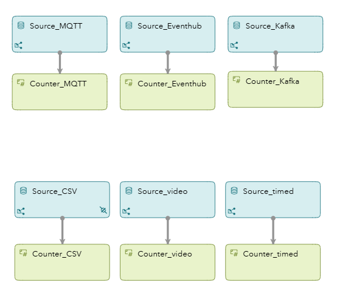
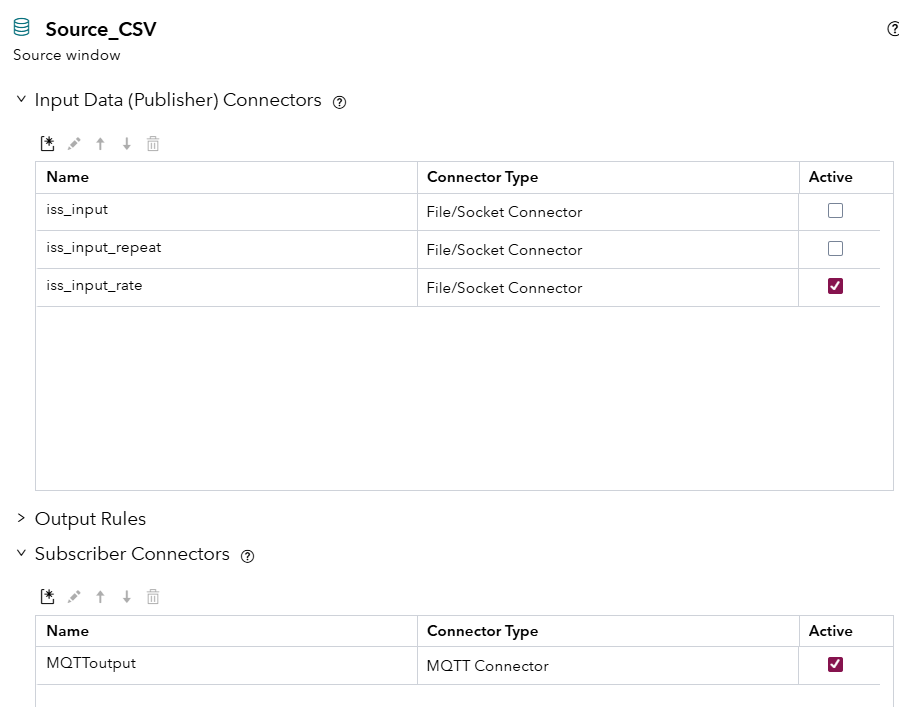
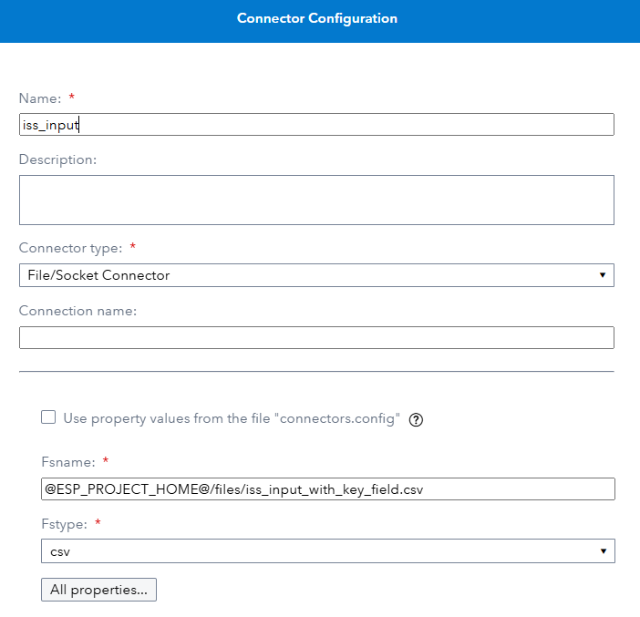
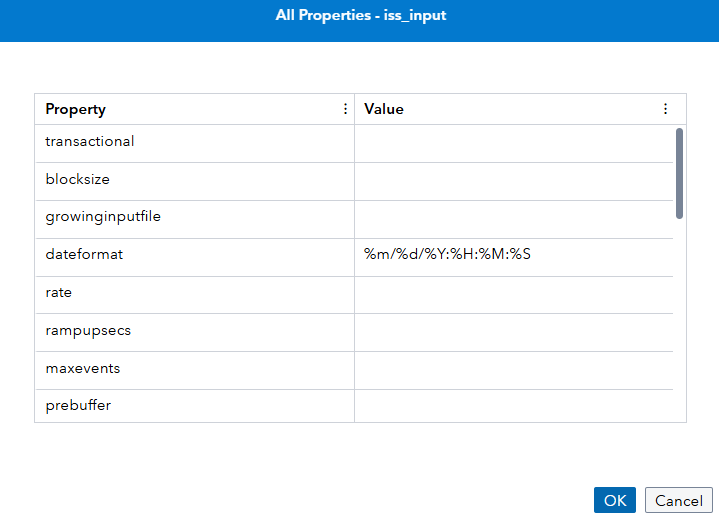

# Exploring ESP Source Connectors
## Overview

In SAS Event Stream Processing (ESP), connectors which run inside the ESP server and adapters which run in their own address space serve as the vital interface between external data systems and your streaming analytics engine. They enable real-time ingestion of data from a wide variety of sources — whether that's sensors via MQTT, logs via Kafka, files on disk, or live video streams over RTSP.

Understanding connectors is fundamental for anyone getting started with ESP, as nearly every real-world application begins with getting data into the system. This example project is designed to help new users visualize and explore how ESP handles this through a set of simple, illustrative connector configurations. You can load this project into ESP Studio or deploy it via the XML directly to see how data flows into a source window from different origins.

For more information about how to install and use example projects, see [Using the Examples](https://github.com/sassoftware/esp-studio-examples#using-the-examples).

## Workflow

The following figure shows the diagram of the project:

	

This project is designed to showcase how different types of source windows can be used to ingest data into a SAS Event Stream Processing (ESP) project. Each source window demonstrates a unique input method—such as reading from a CSV file, consuming messages from Kafka or MQTT, streaming from a video file, receiving events from Azure Event Hub, or generating data on a timed interval. In the sections that follow, I will walk through each source window separately, highlighting the connector class it uses, key configuration properties, and any special considerations for activating or customizing the data feed.  

Connectors in this project are turned off by default and should be turned on as each example is explored.  Connector examples which require external messaging environments to be configured and active will not execute when activated and are shown here purely to aide in future configurations. 

### File/Socket Connector (Source_CSV)

The  Source_CSV window demonstrates how to ingest data into ESP using the File/Socket connector, which is one of the most common and flexible ways to bring in structured data from a flat file. In this example, the input is a CSV file containing timestamped geographic data points, such as longitude and latitude.

	

#### Schema

The schema for the Source_CSV window includes:

- key  (int64, key field): A unique identifier for each record.
- dt  (date): A date field parsed using a specified format.
- long (double): Longitude.
- lat (double): Latitude.

These fields correspond to columns in the source CSV file and are expected to be present in every record.

#### Connector Variants

Multiple connectors are defined for this window to illustrate different ingestion behaviors:

1. **iss_input**

   - Reads the file once from beginning to end.

   - Useful for batch-style loading.

   - Configured with:

     - 	

       - Under All properties the dateformat is set. 

       

2. **iss_input_repeat**

   - Repeats the file input a specified number of times (repeatcount=100).
   - Good for simulation or testing with looping input data.

3. **iss_input_rate**

   - Adds a pacing mechanism to simulate streaming input (rate=1 record per second).
   - Also includes repeatcount=100 to provide enough data over time.

These connectors are declared but set to inactive by default, allowing the user to manually enable one or more depending on the testing or demo scenario.

#### MQTT Connector Note

Interestingly, this source window also includes a connector of a different class MQTToutput configured as a subscriber.  Connectors can be used to ingest data into a project, pub, short for publisher.  Or sub which is short for subscriber.  Subscriber connectors output data from a project to an external file or system.  The MQTT subscriber connector should only be activated when testing the MQTT source example.  This connector adds ISS data to an MQTT topic so that it can be read of the MQTT example.  

  

#### Use Cases

The file/socket connector is ideal for:

- Loading historical data during development.
- Simulating real-time feeds using repeat and rate options.
- Testing schemas and downstream logic before deploying with live connectors.

​	

------

### 2. **Timed Input — `Source_timed`**

The `timer` connector generates events at a fixed interval (e.g., every 60 seconds).

- Includes timestamped fields
- Can be used to simulate heartbeats, time triggers, or scheduled events

🔹 **Use for:** Time-based testing, sampling simulations, or keeping other windows "alive."

------

### 3. **Kafka Input — `Source_Kafka`**

Demonstrates two Kafka connectors for consuming messages:

- One starts from the latest offset
- One reads all messages from the beginning of the topic
- Uses opaque strings to simulate unstructured message ingestion

🔹 **Use for:** Real-time event data, cloud-scale streaming, telemetry pipelines.
 🔹 **Note:** Set as inactive by default; requires a valid Kafka configuration (currently pointing to Azure Event Hubs).

------

### 4. **MQTT Input — `Source_MQTT`**

Configured to read messages from a public MQTT broker (`test.mosquitto.org`).

- Subscribes to a topic named `ExampleforESP`
- Reads opaque strings
- Matches lightweight IoT scenarios

🔹 **Use for:** Edge device data, smart home sensors, gateway telemetry.
 🔹 **Note:** Set as inactive; you can activate and publish messages to this topic to test.

------

### 5. **Azure Event Hubs — `Source_Eventhub`**

This is an example placeholder for reading from Azure Event Hubs.

- Disabled by default
- Requires user setup with an Azure namespace, access keys, and event path

🔹 **Use for:** Cloud event ingestion, scalable IoT data pipelines.

------

### 6. **Video Stream Input — `Source_video`**

Uses the `videocap` connector to read frames from a video file.

- Designed to mimic live camera input
- Publishes image blobs for computer vision pipelines
- Optional resizing and frame rate settings included

🔹 **Use for:** Surveillance analysis, object detection, video streaming analytics.
 🔹 **Note:** Disabled by default; file path points to a demo MP4 video.

## Source Data

The [InputRemove.csv](InputRemove.csv) file contains a list of stock market trades. 

## Test the Project and View the Results

When you test the project, the results for each window appear on separate tabs. The following figure shows the results for the sourceWindow tab. This tab displays all events, with various opcodes. 

## Next Steps

To understand more about how Remove State windows work:
1. Stop the test and return to the removestateWindow window. 
2. In **Settings**, clear all checkboxes for the **Opcodes to be removed** option.
3. Save the project and test it again. 
4. Select the removestateWindow tab. The originalOC column shows that events with various opcodes entered into the window. However, the Opcode column shows that each event has been turned into an Insert. A Remove State window converts all events that it receives into Inserts.

## Additional Resources
For more information, see [SAS Help Center: Using Remove State Windows](https://documentation.sas.com/?cdcId=espcdc&cdcVersion=default&docsetId=espcreatewindows&docsetTarget=p0usk3uf3bcnebn1m99g1jbvvhxu).
