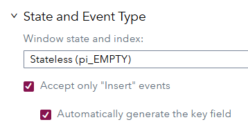
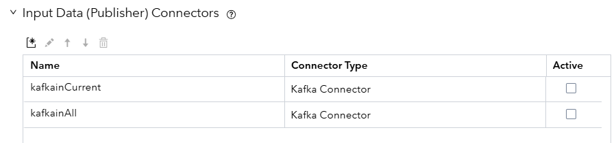
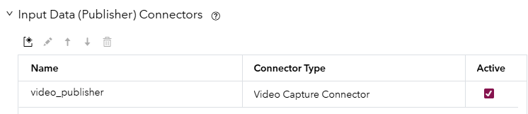

# Exploring ESP Source Connectors
## Overview

In SAS Event Stream Processing (ESP), connectors which run inside the ESP server and adapters which run in their own address space serve as the vital interface between external data systems and your streaming analytics engine. They enable real-time ingestion of data from a wide variety of sources — whether that's sensors via MQTT, logs via Kafka, files on disk, or live video streams over RTSP.

Understanding connectors is fundamental for anyone getting started with ESP, as nearly every real-world application begins with getting data into the system. This example project is designed to help new users visualize and explore how ESP handles this through a set of simple, illustrative connector configurations. You can load this project into ESP Studio or deploy it via the XML directly to see how data flows into a source window from different origins.

For more information about how to install and use example projects, see [Using the Examples](https://github.com/sassoftware/esp-studio-examples#using-the-examples).

## Workflow

The following figure shows the diagram of the project:

	

This project is designed to showcase how different types of source windows can be used to ingest data into a SAS Event Stream Processing (ESP) project. Each source window demonstrates a unique input method—such as reading from a CSV file, consuming messages from Kafka or MQTT, streaming from a video file, receiving events from Azure Event Hub, or generating data on a timed interval. In the sections that follow, I will walk through each source window separately, highlighting the connector class it uses, key configuration properties, and any special considerations for activating or customizing the data feed.  

Connectors in this project are turned off by default and should be turned on as each example is explored.  Connector examples which require external messaging environments to be configured and active will not execute when activated and are shown here purely to aide in future configurations. 

### File/Socket Connector (Source_CSV)

The  Source_CSV window demonstrates how to ingest data into ESP using the File/Socket connector, which is one of the most common and flexible ways to bring in structured data from a flat file. In this example, the input is a CSV file containing timestamped geographic data points, such as longitude and latitude.

	

#### Schema

The schema for the Source_CSV window includes:

- key  (int64, key field): A unique identifier for each record.
- dt  (date): A date field parsed using a specified format.
- long (double): Longitude.
- lat (double): Latitude.

These fields correspond to columns in the source CSV file and are expected to be present in every record.

**Note about event keys**

	 

When working with window schemas, you can either include the key field in your CSV file or let SAS ESP auto-generate keys. Manual keys from your CSV provide consistent record identity across runs and enable traceability back to source systems, but require you to ensure all key values are unique in your dataset. Auto-generated keys simplify data preparation by guaranteeing uniqueness without manual oversight. Regardless of approach, all keys must be absolutely unique within the ESP project, as duplicates cause data corruption and unpredictable behavior.  Uniqueness, can also be achieved by selecting multiple schema fields as keys.

#### Connector Variants

Multiple connectors are defined for this window to illustrate different ingestion behaviors:

1. **iss_input**

   - Reads the file once from beginning to end.

   - Useful for batch-style loading.

   - Configured with:

     - 	

       - Under All properties the dateformat is set. 

       

2. **iss_input_repeat**

   - Repeats the file input a specified number of times (repeatcount=100).
   - Good for simulation or testing with looping input data.

3. **iss_input_rate**

   - Adds a pacing mechanism to simulate streaming input (rate=1 record per second).
   - Also includes repeatcount=100 to provide enough data over time.

These connectors are declared but set to inactive by default, allowing the user to manually enable one or more depending on the testing or demo scenario.

#### MQTT Connector Note

Interestingly, this source window also includes a connector of a different class MQTToutput configured as a subscriber.  Connectors can be used to ingest data into a project, pub, short for publisher.  Or sub which is short for subscriber.  Subscriber connectors output data from a project to an external file or system.  The MQTT subscriber connector should only be activated when testing the MQTT source example.  This connector adds ISS data to an MQTT topic so that it can be read of the MQTT example.  

  

#### Use Cases

The file/socket connector is ideal for:

- Loading historical data during development.
- Simulating real-time feeds using repeat and rate options.
- Testing schemas and downstream logic before deploying with live connectors.

​	

------

### 2. Timed Source Window (Source_timed)

The Source_timed window demonstrates how to use the timer connector to generate synthetic data at regular intervals. This is especially useful for testing, monitoring time-based behaviors, or simulating periodic events in a streaming environment without relying on an external data source.

**Schema**

The schema for this window includes:

- id (int64, key): A unique identifier for each generated record.
- time (stamp): A timestamp value associated with the generated event.
- label (string): A string label to describe or categorize the event.

These fields allow for basic tracking and labeling of each timed event, which can be useful for both functional testing and validating downstream logic such as filtering, pattern detection, or aggregation over time windows.

**Connector Details**

The timer connector is named timer_connector and is configured with the following properties:

- type = pub — Indicates the connector is a publisher (i.e., it injects data into ESP).
- basetime = 2020-06-08 00:56:00 — Sets the starting point for the simulated time field. This is helpful for repeatable tests.
- interval = 60 — Defines how frequently events are generated.
- unit = second — Specifies the interval unit. One event will be generated every 60 seconds.
- label = minutely — Provides a fixed string value for the label field in each record.

This configuration creates a synthetic stream of timestamped records at one-minute intervals. The defined basetime ensures consistency for test runs, which is especially useful when trying to reproduce results.

**Use Cases**

The timed source window is ideal for:

- Testing logic in pattern windows, aggregations, and joins that depend on event timing.
- Monitoring latency or throughput using predictable input rates.
- Simulating "heartbeat" events for pipeline activity verification.
- Driving scheduled processing in demos or training sessions when no live data is available.

------

### 3. Kafka Source Window (Source_Kafka)

The Source_Kafka window demonstrates how to configure a SAS Event Stream Processing (ESP) source window to receive streaming messages from an external Apache Kafka system. Kafka is a widely used messaging platform designed for high-throughput, fault-tolerant, real-time data streams. This connector is useful for integrating ESP with enterprise-grade streaming pipelines where Kafka acts as the central event broker.

**Schema**

The schema for this window is simple and designed to receive text-based messages:

- index (int64, key): A unique identifier or offset for each Kafka message.
- message (string): The content of the Kafka message, treated as an opaque or plain string.  Usually formatted in JSON.  

This schema is general-purpose and can be adapted depending on the expected Kafka payload structure.

**Connector Configuration**

	

This window defines two Kafka connectors, both inactive by default:

1. **kafkainCurrent**
   - Configured to read new messages available to the consumer group 'lastread' that arrive after the connector starts.
   - Uses a secure connection with SASL_SSL and PLAIN authentication.
   - Points to a Kafka broker hosted on Azure Event Hubs, using a special connection string format.
   - Sets kafkatype to "opaquestring", which treats the incoming payload as a raw string without parsing.
2. **kafkainAll**
   - Configured to start reading from the beginning of the Kafka topic (kafkainitialoffset=smallest).
   - Reads from all partitions (kafkapartition=-1), which is useful for testing or replay scenarios.
   - Shares the same connection and topic settings as kafkainCurrent.

Both connectors specify the Kafka host as saslorahub.servicebus.windows.net:9093 and the topic as lorahub.  These details are specific to Azure Event Hubs used in Kafka compatibility mode.

**Important Note on Activation**

This source window is defined in the project but **will not function until an external Kafka system is properly configured and running**. In particular:

- The Kafka broker must be reachable from the ESP server.
- The authentication settings must match those expected by the Kafka system (e.g., Event Hub keys and SASL configuration).
- The topic and partition configuration must align with the available Kafka setup.

By default, both connectors are set to inactive (active="false") to avoid connection failures when the project is loaded in an environment without access to the configured Kafka infrastructure.

**Use Cases**

Kafka source connectors are ideal for:

- Ingesting large-scale event data from operational systems.
- Streaming logs, sensor readings, financial transactions, or telemetry data.
- Integrating with enterprise pipelines already built on Kafka or Azure Event Hubs.
- Supporting real-time analytics on live data as it flows through the Kafka stream.

------

### 4. MQTT Source Window (Source_MQTT)

The Source_MQTT window demonstrates how to configure SAS Event Stream Processing (ESP) to receive messages over the MQTT protocol. MQTT is a lightweight publish/subscribe messaging protocol commonly used in IoT applications due to its low overhead and ease of use. This source window is useful for streaming data into ESP from MQTT-compatible devices, brokers, or simulated publishers.

**Schema**

The schema for this window includes the following fields:

- key (int64, key): A unique identifier for each incoming message.
- topic (string): The name of the MQTT topic on which the message was received.
- message (string): The payload of the message, treated as an opaque string.

This schema allows ESP to capture the topic and content of each message, which can be useful for multi-topic ingestion or filtering logic based on topic name.

**Connector Configuration**

The connector for this window is named `MQTTinput` and is defined with the following properties:

- type = pub — Indicates the connector is a publisher that injects data into ESP.
- mqtthost = test.mosquitto.org — Specifies the public MQTT broker being used.
- mqttport = 1883 — Uses the default, non-secure MQTT port.
- mqtttopic = ExampleforESP — The topic to which the connector subscribes.
- mqttqos = 0 — Quality of Service level set to 0 (fire and forget).
- mqttmsgtype = opaquestring — Treats the incoming message as a raw string.

The connector is defined but not active by default. It must be manually enabled to connect to the broker and receive messages.

**Important Note on Data Flow**

This source window alone will not show any data unless a publisher is actively sending messages to the topic ExampleforESP on the public broker at test.mosquitto.org. Fortunately, this ESP project includes a built-in MQTT **subscriber connector** attached to the CSV source window that can act as a publisher.

To see data flow through the MQTT topic and into this window:

1. **Turn on the MQTT sub connector in the CSV source window.**
    The connector named MQTToutput in the Source_CSV window is configured as a subscriber but effectively acts as a publisher in this setup—it reads from a CSV file and publishes the records to the MQTT topic.
2. **Use the rate-controlled CSV connector (iss_input_rate).**
    This connector in the Source_CSV window emits one record per second, allowing you to clearly observe individual messages flowing through the system. This slower pacing is helpful for visual debugging, demonstrations, and learning.

With this setup, messages will be read from a local CSV file, published to the MQTT broker via the MQTToutput connector, and then picked up by the Source_MQTT window as they are received on the topic.

**Use Cases**

MQTT source connectors are well suited for:

- Ingesting IoT sensor data from edge devices.

- Receiving telemetry from low-power, intermittently connected clients.

- Demonstrating event flow in low-bandwidth scenarios.

- Learning or testing publish/subscribe patterns using public or local brokers.

### Testing the Source_video Window and View the Results

------

### 5. Event Hub Source Window (Source_Eventhub)

The Source_Eventhub window demonstrates how to receive streaming data from **Azure Event Hubs**, a highly scalable, cloud-based data streaming platform. Event Hubs is designed for ingesting millions of events per second from connected devices, services, or applications, making it an excellent source for real-time analytics pipelines in ESP.

This window is particularly useful when integrating SAS Event Stream Processing with cloud-hosted event sources, such as IoT telemetry, application logs, or metrics produced by Azure-native services.

**Schema**

The schema defined for this window includes:

- index (int64, key): A numeric identifier that typically corresponds to the event's position in the Event Hub stream.
- message (string): The raw message content from the event, treated as a plain string.

This simple structure is flexible enough to accommodate various message formats, including JSON, XML, or custom-delimited text.

**Connector Configuration**

The connector used in this window is of class `eventhubs` and is named `EventhubInput`. It includes the following key properties:

- type = pub — Indicates this is a publishing connector that injects events into the ESP pipeline.
- eventhubsincludeindex = true — Ensures that the message index is included in the stream.
- eventhubsconnectionstring — Contains the full connection string needed to authenticate and connect to the Azure Event Hub instance.
- eventhubspath = lorahub — Specifies the Event Hub namespace or entity path to consume messages from.
- eventhubsconsumergroup = esp — Designates the consumer group to track offset and session state.
- eventhubspartition = 0 — Specifies the partition to read from.
- eventhubsformat = opaque — Treats incoming data as unparsed strings.

These settings are designed to work with an Azure Event Hub that has been pre-configured to stream data into the `lorahub` namespace, using shared access credentials provided in the connection string.

**Activation Note**

This window is defined but will not function unless a valid, **externally configured Azure Event Hub** is available and properly set up. Specifically:

- The connection string must point to a real Event Hub instance in Azure.
- The Event Hub must be actively receiving and holding event data for ESP to consume.
- The ESP server must have internet access and proper networking permissions to reach the Azure endpoint.
- The connector is set to inactive by default to avoid connection errors during deployment in environments without access to Azure.

Without a working Azure Event Hub configured to match these settings, no data will flow through this window, and the connector will remain idle.

**Use Cases**

Event Hub connectors are ideal for:

- Connecting to high-volume telemetry or log data pipelines hosted in Azure.
- Integrating ESP with cloud-first applications or IoT deployments using Azure IoT Hub (which can route data into Event Hubs).
- Performing real-time monitoring and alerting on event data from applications, services, or devices.

------

### 6. RTSP/Video Source Window (Source_video)

The Source_video window is designed to demonstrate how to ingest video frames into an ESP project using the videocap connector. This window is typically used for computer vision and image processing tasks where video data must be analyzed in real time or near real time. While the connector supports both camera and file-based input, this example uses a local video file for simplicity and repeatability.

**Schema**

The schema for this window includes:

- id (int64, key): A unique identifier for each frame.
- image (blob): A binary large object containing the raw video frame data.

This simple schema allows downstream analytics windows, such as image recognition or object detection modules, to process each frame as it enters the ESP engine.

**Connector Configuration**

The connector used in this window is of class `videocap` and is named `video_publisher`. It is configured with the following properties:

- type = pub — Indicates this connector acts as a publisher, injecting video frames into ESP.
- inputrate = 10 — Specifies the desired frame rate in frames per second. ESP will attempt to extract and publish up to 10 frames per second from the video source.
- repeatcount = 999 — Repeats the video file multiple times to simulate a continuous feed. This is especially useful for demos or automated testing.
- resize_x = 1280 and resize_y = 720 — Resizes each frame to a resolution of 1280x720 pixels before it is published.
- blocksize = 1 — Controls the number of frames published per batch. A value of 1 means frames are sent individually.
- filename = @ESP_PROJECT_HOME@/test_files/intersection.mp4 — The path to the input video file used in the demo.
- publishformat = wide — Determines the format of the frame data. "Wide" format publishes each frame as a single record with the entire image in the blob field.

**Activation Note**

In this project, the video connector is declared but set to inactive by default. This allows users to enable it manually when they are ready to run the demo. The connector expects that the specified video file exists at the given path and is accessible to the ESP server.

**Use Cases**

This type of source window is ideal for:

- Real-time video analytics such as object detection, motion tracking, or license plate recognition.
- Streaming camera feeds from RTSP-compatible devices like IP cameras.
- Simulating video input using repeatable file-based sources for development and testing.
- Demonstrating computer vision models and their deployment in an event stream processing pipeline.

### Testing the Source_video Window and View the Results

Ensure that the Video Capture Connector is activated and run the project.

	When you test the project, the results for each window appear on separate tabs. The following figure shows the results for the source window tab. This tab displays all events, with various opcodes.  Note that the image is transcoded into a non human readable blob format. 

## Additional Resources
For more information, see [SAS Help Center: Using Remove State Windows](https://documentation.sas.com/?cdcId=espcdc&cdcVersion=default&docsetId=espcreatewindows&docsetTarget=p0usk3uf3bcnebn1m99g1jbvvhxu).
