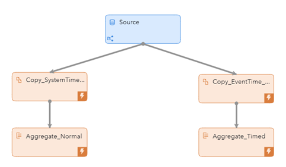
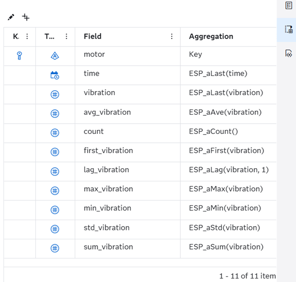
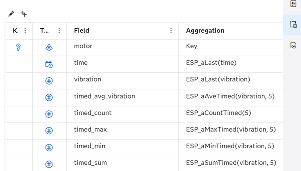
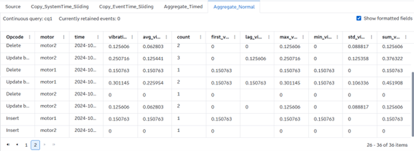
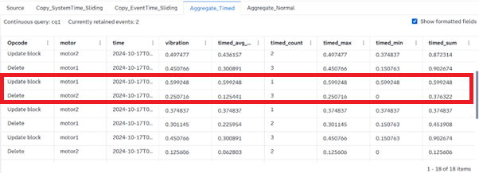

# Introduction to Aggregate Window and Aggregate Functions
## Overview

This SAS Event Stream Processing (ESP) project demonstrates how to use the Aggregate window, and the different types of aggregation functions it supports. Aggregate window allows you to add simple statistics like sum, mean, std deviation and more to the streaming data. Since these calculations are provided out of the box and implemented on the streaming data, these are very fast, matching the rate of the incoming data. 

Aggregate windows are always Stateful which means they need to retain the events. Therefore, Aggregate windows, almost always, go with Copy window preceding them with retention to manage the size of the state.

For more information about how to install and use example projects, see [Using the Examples](https://github.com/sassoftware/esp-studio-examples#using-the-examples).

## Use Case
- You need to add basic statistics to the Streaming data. These statistics are used in the ESP model as filtering criteria or for further calculations.
- The Aggregate window can also be used to capture the first occurrence in a group which will be an Insert event.

## Source Data
The file, input.csv, contains a dummy motor vibration data where the fields motor and time in microseconds together identify a unique event. The value here is dummy vibration data of motors which are emitting the events at a rate of 1 event per second.

## Workflow
The example shows what are the different aggregation functions that you can use with Aggregate window. The following figure shows the diagram of the project:

	

Here you see two Aggregate windows each preceded by a Copy window.
- Source is a Source window which reads the input.csv file using a Python connector and publishes the events at a rate of 1 per second.
- Copy_SystemTime_Sliding is a Copy window which has a sliding system time based retention of 5 seconds.
- Copy_EventTime_Sliding is a Copy window which has a sliding event time based retention of 5 seconds.
- Aggregate_Normal is an Aggregate window which has different normal aggregate functions
- Aggregate_Timed is an Aggregate window which has different time based aggregate functions.

### Aggregate_Normal
You can select the Aggregate_Normal window to see the schema of the window in the Output schema pane on the right side.

In this window, the “motor” field acts as the group by key. This means that the aggregation will happen for unique values of the “motor” field. When events arrive in the Aggregate window, they are placed into aggregate groups based on the value of the “motor” field.

Below you can get the description of the different fields and their corresponding aggregate function:
- **time**: ESP_aLast(time) function copies the value of “time” field of the latest event in the aggregate group.
- **vibration**: ESP_aLast(vibration) function copies the value of “vibration” field of the latest event in the aggregate group.
- **avg_vibration**: ESP_aAve(vibration) function calculates the average of the vibration field of all events in the aggregate group
- **count**: ESP_aCount() functions returns the count of all events in the aggregate group
- **first_vibration**: ESP_aFirst(vibration) function returns the value of vibration field of the first event added to the aggregate group
- **lag_vibration**: ESP_aLag(vibration, 1) function returns the value of vibration for the immediately previous event that got added to the aggregate group.
- **max_vibration**: ESP_aMax(vibration) function returns the maximum value of the vibration field among the events in the aggregate group
- **min_vibration**: ESP_aMin(vibration) function returns the minimum value of vibration field among the events in the aggregate group
- **std_vibration**: ESP_aStd(vibration) function calculates the standard deviation of the vibration field of all events in the aggregate group
- **sum_vibration**: ESP_aSum(vibration) function calculates the sum of the vibration of all events in the aggregate group

### Aggregate_Timed
You can select the Aggregate_Timed window to see the schema of the window in the Output schema pane on the right side.

In this window, the “motor” field acts as the group by key. This means that the aggregation will happen for unique values of the “motor” field. When events arrive in the Aggregate window, they are placed into aggregate groups based on the value of the “motor” field.

This window presents timed calculations. These values clear without having to introduce event retention based on the time interval provided as the function argument. When a new event arrives N or more seconds after the first event, the previous calculated value is cleared.

Below you can get the description of the different fields and their corresponding aggregate function:
- **timed_avg_vibration**: ESP_aAveTimed(vibration, 5) function calculates the average of the vibration field of all events in the aggregate group. This average calculation clears when a new event arrives after 5 seconds.
- **timed_count**: ESP_aCountTimed(5) function returns the count of all events in the aggregate group. The count is cleared whenever a new event arrives after 5 seconds.
- **timed_max**: ESP_aMaxTimed(vibration, 5) function returns the maximum value of the vibration field among the events in the aggregate group. This max is cleared whenever a new event arrives after 5 seconds
- **timed_min**: ESP_aMinTimed(vibration, 5) function returns the minimum value of vibration field among the events in the aggregate group. This min is cleared whenever a new event arrives after 5 seconds.
- **timed_sum**: ESP_aSumTimed(vibration, 5) function calculates the sum of the vibration of all events in the aggregate group. This sum is cleared whenever a new event arrives after 5 seconds.

## Test the Project and View the Results

When you test the project, the results for each window appear on separate tabs.
- Source tab lists raw events published into the project
- Copy_SystemTime_Sliding tab lists insert and delete events generated because of system time based sliding retention
- Copy_EventTime_Sliding tab lists insert and delete events generated because of event time based sliding retention
- Aggregate_Normal tab lists insert, deletes and update events generated because of the aggregate group being updated with each incoming event
- Aggregate_Times tab lists insert, deletes and update events generated because of the aggregate group being updated with each incoming event along with calculated values clearing out due to timed function

The following figure shows the results of the Aggregate_Normal window:

Notice that the first events for motor1 and motor2 are with Insert opcodes. This is because with these events the aggregate group based on motor is created and each group has their corresponding first event. For each subsequent event in a group a delete event is generated to delete the last aggregated event in that group and an update block event is generated with a new aggregated event.

The following figure shows the results of the Aggregate_Timed window:

Here notice the highlighted events for motor1 group. The Delete event if for the previous state of the group. However, for the Update Block event, the aggregated values have been reset based on the time. As a result of this, the values for vibration, timed_average, timed_max, timed_min and timed_sum are all same.

## Additional Resources
For more information, see [SAS Help Center: Using Aggregate Windows](https://documentation.sas.com/?cdcId=espcdc&cdcVersion=default&docsetId=espcreatewindows&docsetTarget=p1i6d35raag9lbn1512750fhhd1x).

