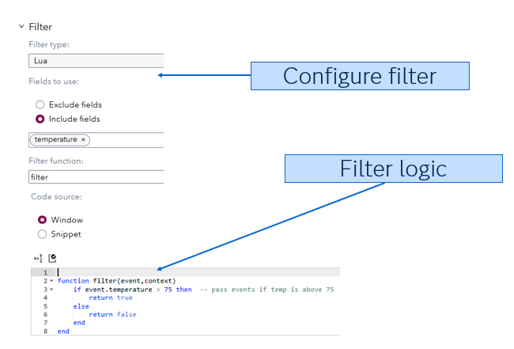
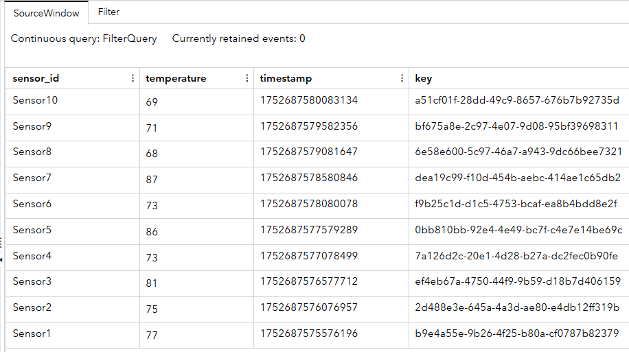
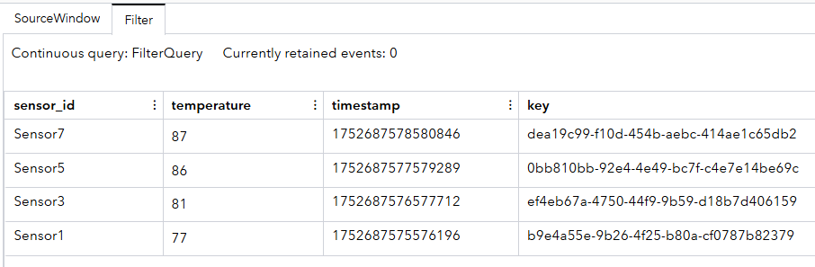

## How Do Filter Windows Work in ESP?

### Overview

This project demonstrates how **filter windows** operate in **SAS Event Stream Processing (ESP)**. Specifically, it shows how data streaming in from simulated sensors can be evaluated in real time, and only records meeting a certain condition (in this case, temperature readings above 75°F) are passed downstream for further action or analysis.

------

### Source Data

The source data is generated by a **Lua connector** that simulates 10 temperature sensor readings. Each reading contains:

- `sensor_id`: Identifier for the sensor (e.g., “Sensor1” to “Sensor10”)
- `temperature`: A randomly generated Fahrenheit temperature between 65 and 90
- `timestamp`: The system time when the reading is generated
- `key`: A unique string used as the primary key

This data is published at an interval of 500 milliseconds.

------

### Workflow

		

This project contains two main windows connected in a simple linear workflow:

1. **SourceWindow**
    This is a window-source that receives data from the Lua connector. It defines the schema and structure for incoming events.
2. **Filter** This is a window-filter that contains logic to check if the temperature is above 75°F. If so, the event is forwarded; otherwise, it is discarded.  Filter logic can be coded in Lua, Python, C or Expression language.  

------

------

### Test the Project and View the Results

When you test the project, the results for each window appear on separate tabs. The following figure shows the results for the sourceWindow tab. This tab displays all events, with various opcodes.

	

There are 10 sensor readings containing temperatures ranging from 69 thru 87 degrees.  When we apply a greater than 75 filter the number of events drops to four. 

	

------

### Additional Resources

For more details on **the filter window**, refer to the official documentation:  [Using Filter Windows](https://go.documentation.sas.com/doc/en/espcdc/v_061/espcreatewindows/p1laytbc862ix9n1w5rm9reywors.htm)

