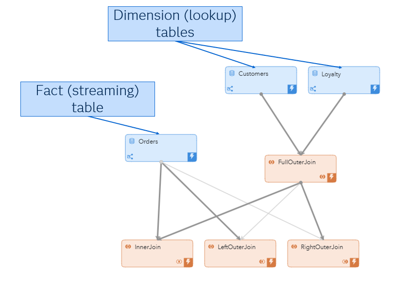
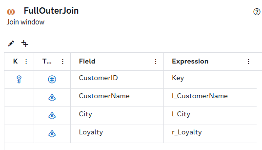
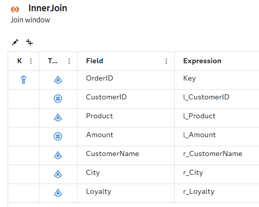
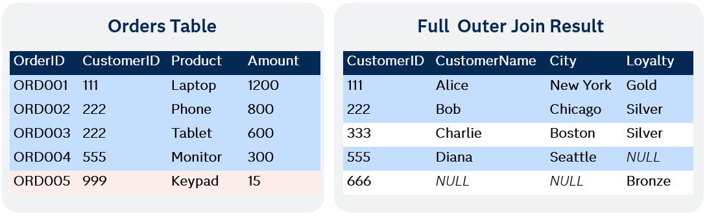
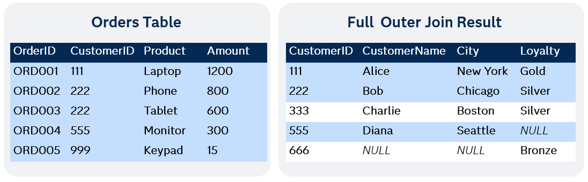
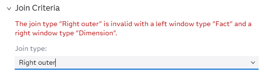

# SAS ESP Join Window 

## Overview
This example demonstrates all the various ways to use SAS ESP join windows with three sample data sources. Join windows in SAS ESP allow you to combine streaming data from multiple sources based on specified join conditions.

### Understanding Fact and Dimension Inputs

In SAS ESP streaming analytics, understanding the distinction between facts and dimensions is crucial for designing effective join operations.

**Dimensions** = Small to large, reference/lookup tables. When tables are large, indexing may provide improved performance.

**Facts** = Large, transactional streams.

In a **join window** in SAS ESP:

- The join window has a **left input** (often called the *fact* table) and a **right input** (often called the *dimension* table).
- The **left (fact) input** is usually the stream of events you want to enrich — e.g., sensor readings, transactions, clickstream.
- The **right (dimension) input** is typically a lookup or reference stream with the fields you’ll use to join on — e.g., customer master data, machine configuration.

This fundamental difference in data characteristics drives how SAS ESP optimizes join operations and determines which stream should be assigned to which input for best performance.

## Workflow

The project shown above will be used to show how different join types behave when combining a streaming fact table with dimension/lookup tables.

------

### **Top part: Dimension (lookup) tables**

- **Customers** → static (lookup) info about customers (e.g., ID, name, city).
- **Loyalty** → static (lookup) info about loyalty status (e.g., Silver, Gold, Bronze).

These are *dimension windows*, meaning they provide reference data to enrich the fact stream.

------

### **Middle part: Fact (streaming) table**

- **Orders** → the *fact window*, which receives a continuous stream of events (e.g., new customer orders).

This is the “driver” stream that you want to enrich with data from Customers and Loyalty.

------

### **Join windows**

#### **Why FullOuterJoin is used in the middle**

**FullOuterJoin**: combines **Customers** + **Loyalty**, so that downstream you have a unified view of customer + loyalty info. This is often used as a *pre-join step* to simplify your pipeline.   That way, instead of joining Orders against two tables separately, you have a single unified dimension table containing all the info. Then you can test different join strategies between streaming orders and this dimension.   It should also be noted that the Full outer joins only can only combine two dimension tables.  Therefore, it is not possible to show the full outer join using the orders fact table.  

#### **Bottom part: Different join types**

From there, the **Orders** fact stream is joined with the customer+loyalty data using all three join types, so you can compare behavior:

1. **InnerJoin**
2. **LeftOuterJoin**
3. **RightOuterJoin**

## Sample Data Sources

In this example, we’re working with the following data sources: **Orders**, **Loyalty** and **Customers**. The **CustomerID** column serves as the common key. Here, the **Customers** and **Loyalty** tables provide additional information to enrich the data, while the **Orders** table represents the continuous stream of events that we want to enhance with that information.

## Join Window Types and Configurations

In this section, we’ll explore four common types of joins: **Inner Join, Left Outer Join, Right Outer Join, and Full Outer Join**. Joins are used to combine data from multiple sources based on a shared key, allowing us to bring together related information in meaningful ways. Each join type determines which records from the input tables are included in the result, and understanding the differences is key to choosing the right approach for your data.

### Full Outer Join

**Purpose**:  A **full outer join** brings together **all rows from both tables**, matching them where keys line up, and filling in `NULL` (or blanks) where they don’t.  In our customer example, we want to include all customers whether they are part of the loyalty program or not.  

**ESP Configuration**:

	

Note that the schema contains elements from the left and right side of the join and are denoted by a "l" or "r" in the Expression column of the schema. 

	

Here you can see that Loyalty is coming from the right side of the join while CustomerName and City come from the left. 

		

- **Matched records (111, 222, 333):** Both tables had these CustomerIDs, so all columns are populated
- **Customer 555 (Diana):** Exists only in Customers table, so Loyalty is NULL
- **Customer 666:** Exists only in Loyalty table, so CustomerName and Amount are NULL
- This new combined table will be used for the remaining join examples.

**Test the Project and View the Results**:

When running this project in test mode the FullOuterJoin tab shows the following: 

	

Note the Customer table records are inserted first and later updated when the Loyalty data is received.  The deletes of the records before the update can be ignored.  	

### Inner Join

**Purpose**: Shows only records where CustomerID exists in both tables. Records are matched based on the CustomerID key. 

**ESP Configuration**:

	

Note that the schema contains elements from the left and right side of the join and are denoted by a "l" or "r" in the Expression column of the schema.

	

	

	

With Orders acting as the **fact table** and Customers/Loyalty as the combined **dimension table**, a record is generated for each order received where the CustomerID matches. 

- **Matched records (111, 222, 555):** Both tables had these CustomerIDs, so all columns are populated
- **Customer 555 (Diana):** Loyalty is set to NULL
- **Order 999 ** Does not exist in the dimension table and is therefore dropped

**Test the Project and View the Results**:

### Left Outer Join
**Purpose**: Returns all records from the fact stream, with matching records from the dimension stream where available.  

		

		

Here we create a record for every event which enters the steam on the fact side, which in this case is the left side.  Therefore, ORD005 creates a joined event even when all the dimension fields are NULL.

**Test the Project and View the Results**:

### Right Outer Join
**Purpose**: Returns all records from the right stream, with matching records from the left stream where available.

This join type is not compatible with our project because ESP joins Fact tables (streaming) with Dimension tables (lookup).  Since our Orders table is on the left side, when you try to pick the join type of Right Outer join ESP studio will give you the following error. 

	

The only way to fix this issue is to re-arrange the project so that the Fact tables are streaming in on the right side.  This or course makes no sense to do because when you do that you have logically created the same functionality as a left outer join.  Since it is logically equivalent to the left outer join there is no added functionality to used it over convenience.  

This demo provides a comprehensive overview of all SAS ESP join window capabilities using realistic sample data that clearly demonstrates the differences between each join type.

