# SAS Event Stream Processing Join Window 

## Overview
This example demonstrates all the various ways to use SAS Event Stream Processing Join windows. Join windows in SAS Event Stream Processing enable you to combine streaming data from multiple sources based on specific join conditions.

For more information about how to install and use example projects, see [Using the Examples](https://github.com/sassoftware/esp-studio-examples#using-the-examples).

## Source Data

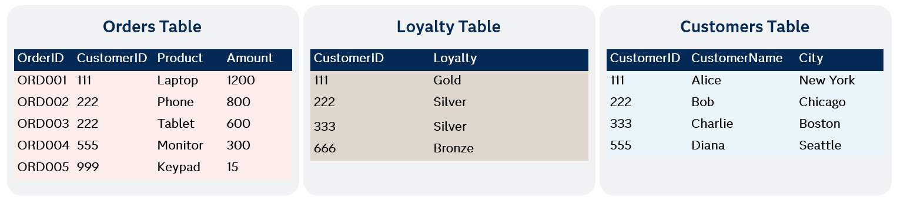

The example contains three source files: `customers.csv`, `loyalty.csv`, and `orders.csv`. The **CustomerID** column is the common key. The `customers.csv` and `loyalty.csv` files provide additional information to enrich the data, while the `orders.csv` file represents the continuous stream of events that enhance the information.

## Prerequisites

In SAS Event Stream Processing streaming analytics, you must understand the distinction between facts and dimensions in order to design effective join operations.

Join windows consist of the following:

- The join window has a left input, which is known as a fact table. It also has a right input, which is called a dimension table. 
- The left input is the stream of events you want to enrich (for example, sensor readings, transactions, and clickstreams).
- The right input is a lookup or reference stream with the fields you use to create a join (for example, customer master data or machine configuration).

The difference in data characteristics drives how SAS Event Stream Processing optimizes join operations and determines which stream should be assigned to which input for best performance.

## Workflow

The following figure shows the diagram of the project:

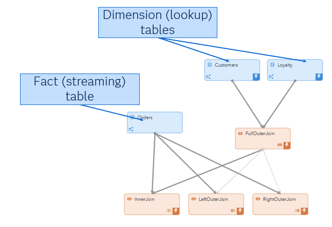	

- The Customers window is a Source window that contains a dimension table with information about customers (for example, ID, name, and city).
- The Loyalty window is a Source window that contains a dimension table with information about loyalty status (for example, Silver, Gold, or Bronze).
- The Orders window is a Source window that contains a fact table that receives a continuous stream of events (for example, new customer orders).
- The FullOuterJoin window is a Join window that combines Customers and Loyalty. This helps create a unified view of all the information. This is used as a pre-join step to simplify your pipeline. Note that full outer joins can only be used with two dimension tables. It is not possible to full outer join a fact table.
- The InnerJoin window is a Join window that performs an inner join of the tables.
- The LeftOuterJoin window is a Join window that performs a left outer join of the tables.
- The RightOuterJoin window is a Join window that performs a right outer join of the tables.
<!-- So aren't they techinically Source windows that contain dimension and fact tables? -->

### Full Outer Join

A full outer join brings together all rows from both tables, matching them where keys align. Otherwise, it fills in `NULL` where keys do not align. In the customer example, you want to include all customers whether they are part of the loyalty program or not.  

Explore the settings for the FullOuterJoin window:
1. Open the project in SAS Event Stream Processing Studio. 
2. Select the FullOuterJoin window. The window should look like the figure below:

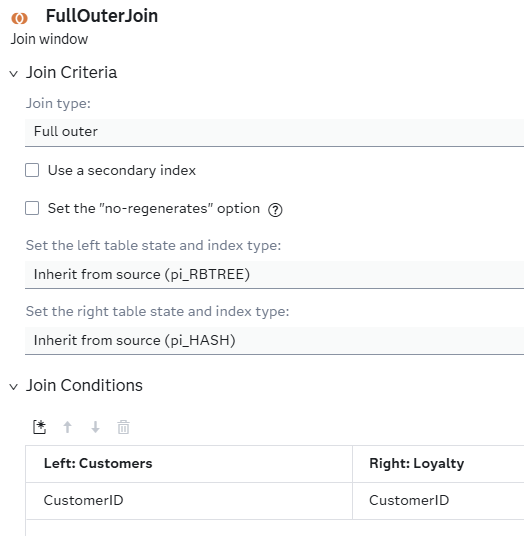	

3. Click . Fields include:
   - `CustomerID`
   - `CustomerName`
   - `City`
   - `Loyalty`

Notice that `Loyalty` is coming from the right side of the join while `CustomerName` and `City` come from the left. 

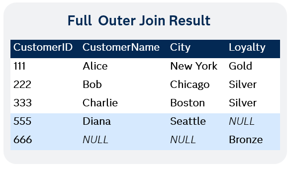		

Results:
- 111, 222, and 333: The first three rows are matched records, which means both tables contained these `CustomerIDs`.
- 555: This record only exists in `customers.csv`, so `Loyalty` is `NULL`.
- 666: This record only exists in `loyalty.csv`, so `CustomerName` and `Amount` are `NULL`.

**Test the Project and View the Results**:

When you test the project, the results for each window appear on separate tabs:
- The FullOuterJoin tab lists...
- The InnterJoin tab lists...
- The LeftOuterJoin tab...
- The RightOuterJoin tab...

The following figure shows the results for the FullOuterJoin tab:

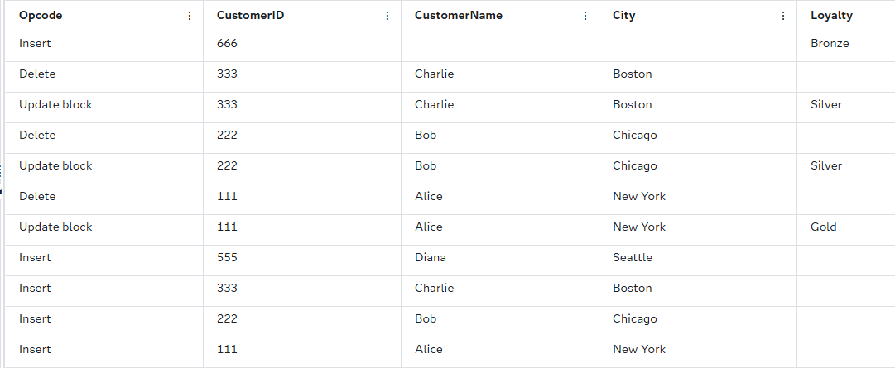	

The following figure shows the results for the InnerJoin tab:

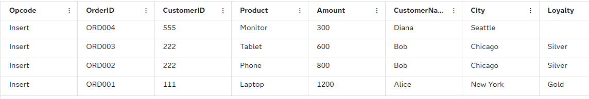

### Inner Join

An inner join only shows records where `CustomerID` exists in both tables. Records are matched based on the `CustomerID` key. 

Explore the settings for the InnerJoin window:
1. Open the project in SAS Event Stream Processing Studio. 
2. Select the InnerJoin window. The window should look like the figure below:

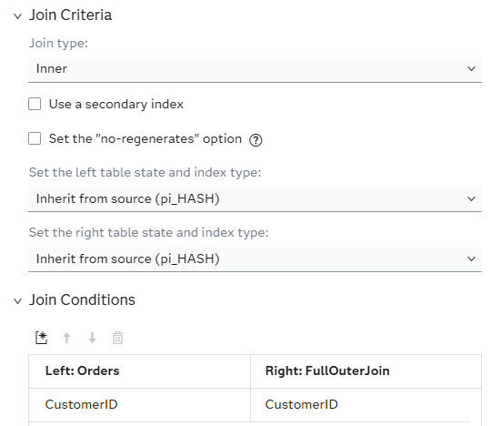	

3. Click . Fields include:
   - `OrderID`
   - `CustomerID`
   - `Product`
   - `Amount`
   - `CustomerName`
   - `City`
   - `Loyalty`

`Orders.csv` acts as the fact table and the table created from the full outer join is the dimension table. A record is generated for each order received where the `CustomerID` matches. 

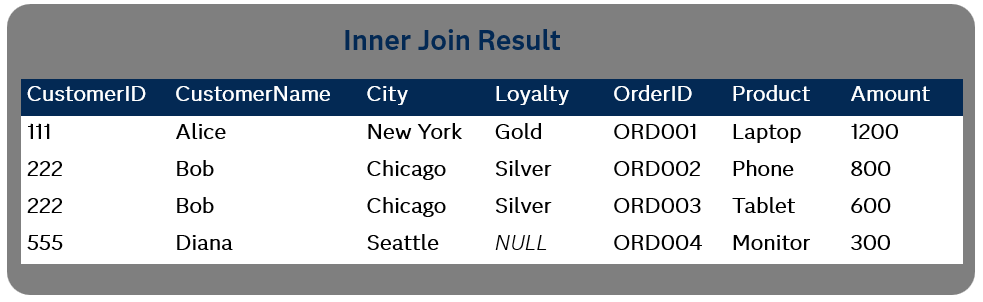	

### Left Outer Join
A left outer join returns all the records that match from the fact table stream with records from the dimension table stream.	

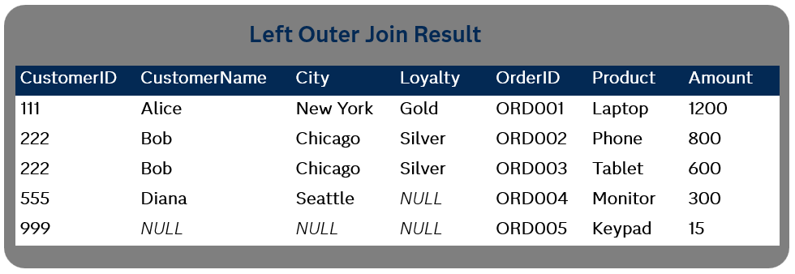		

The left outer join creates a record for every event which enters the data steam from the fact table, which in this case is the left side. Therefore, **ORD005** creates a joined event even when all the dimension fields are `NULL`:

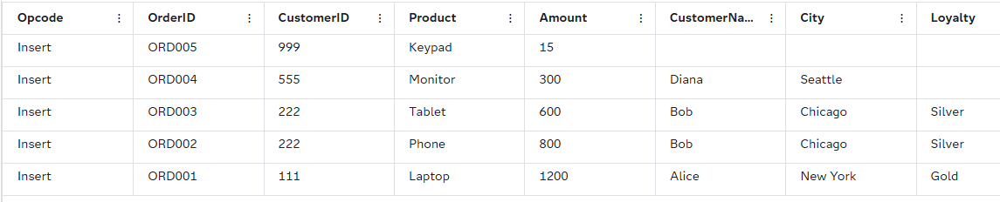

### Right Outer Join
A right outer join returns all the records that match from the dimension table with records from fact table.

**NOTE:** This join type is not compatible with the project because orders.csv streams in from the left side. To fix this issue, the project was rearranged so that the fact table streams in from the right side. The schema entries were rebuilt. The project is already fixed for you, but if you encounter this error in another project, you can use the following steps to fix it.

1. Open the project in SAS Event Stream Processing Studio. 
2. Select the RightOuterJoin window. The window looks like the figure below:

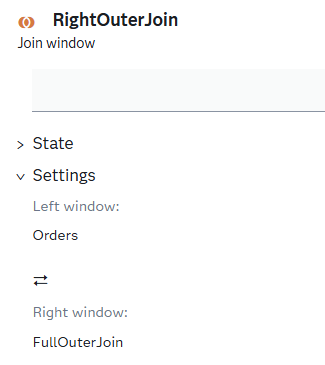	

This clearly states that the left window is **Orders**, and the right window is **FullOuterJoin**. You need to change this by clicking . This generates the following message: 

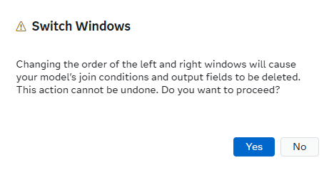	

After clicking yes you can now see that the Left and Right designations are reversed. In the version of the project you’re working with, this fix has already been implemented — the fact stream is on the right side and the schema rebuilt — so you can run the Right Outer Join without re-arranging anything yourself.

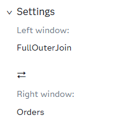	

This action also deletes the old schema so it will need to be rebuilt.  Once rebuilt the orders fact table are now prefixed with "r_" .

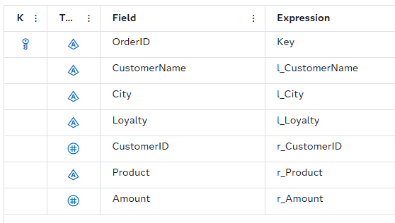	

This means the streaming or fact side is now on the right instead of the left.  Logically this is the same as doing a left outer join as show in the the results below: 

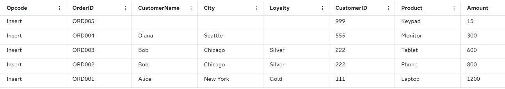	

## Join Window and State Management 

In SAS Event Stream Processing (ESP), the concept of state typically refers to the stored event data that a window maintains in memory over time or by count.  When you see a lightning bolt in the lower right of the ESP project window it indicates that the window is storing events in memory or has become stateful. 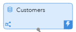	In a production environment the fact side of the project is infinite.   No program can store an infinite amount of data therefore the size of the records maintained in memory needs to be managed.  The Join window in ESP allows you to set the state for the left and right inputs separately.  Under join criteria you will see the following: 

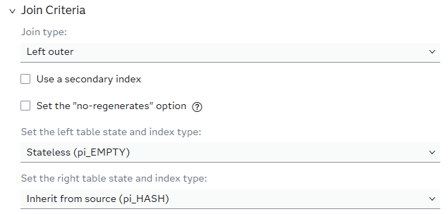	

The fact side of the window is set to stateless, meaning no events are stored except for the current record.   The only memory which will be used to store event data will be on the dimension  or right side in this case.  This effectively removes any unbounded memory growth issues from the project.  

### Secondary Indexes

When a record is received in the orders window it will need to be matched to a corresponding record in the dimension data.  A lookup is issued for the CustomerID to see if there is a match in the dimension table.   When a dimension table is large or is updated frequently, enabling a secondary index can improve lookup performance. To do this, select **Use a secondary index** in the Join Criteria section.

## Summary

This demo shows how SAS Event Stream Processing (ESP) join windows let you **enrich live data streams with contextual information** from reference tables in real time. By combining fast-moving “fact” data (like orders, sensor readings, or transactions) with “dimension” data (like customer records or machine configurations), you can make decisions and detect patterns as events happen instead of after the fact. The walkthrough explains why to pre-join dimension tables, how to choose the right join type for your outcome, and how to configure state so only necessary records are held in memory. Following these practices yields lower latency, avoids unbounded memory growth, and makes streaming pipelines easier to maintain and scale.

