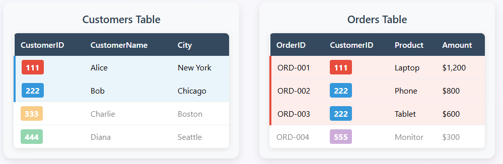
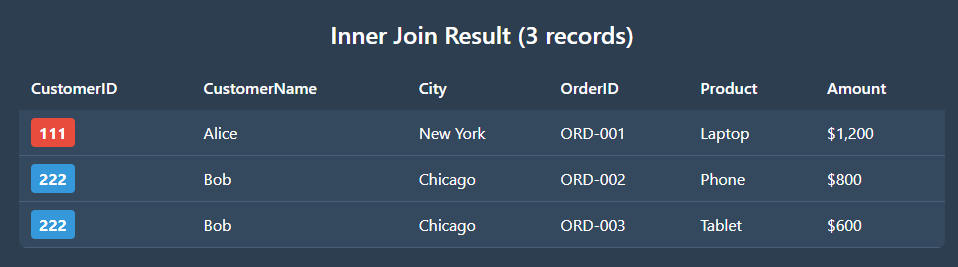
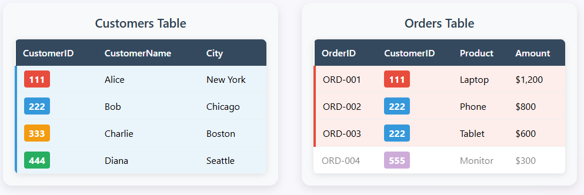
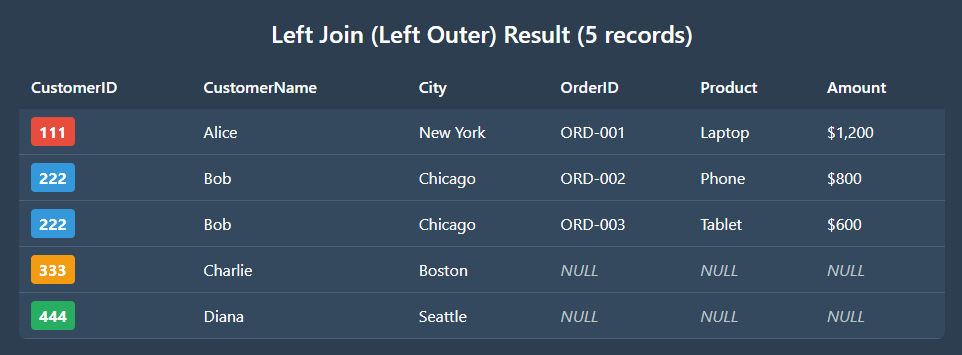
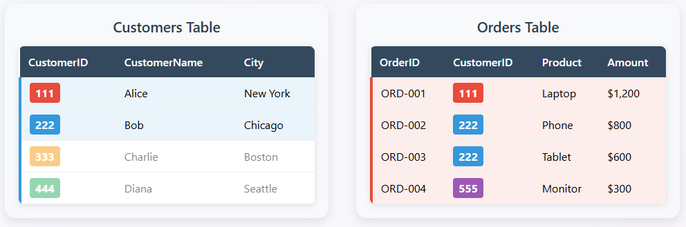
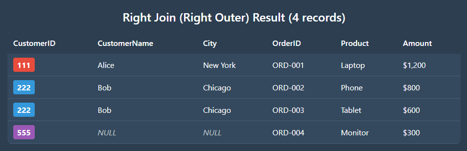
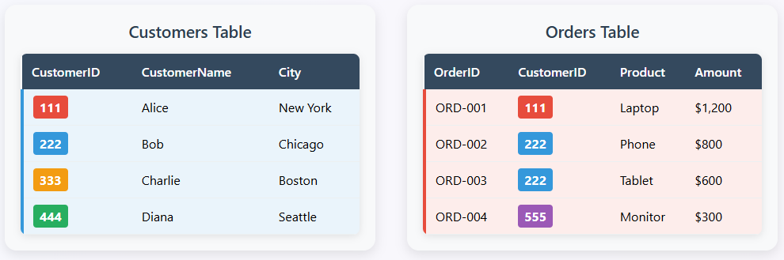
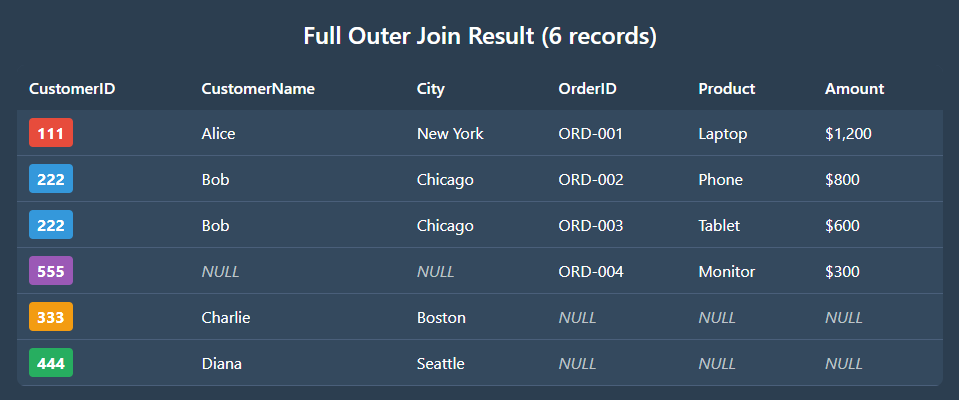

# SAS ESP Join Window 

## Overview
This example demonstrates all the various ways to use SAS ESP join windows with two sample data sources. Join windows in SAS ESP allow you to combine streaming data from multiple sources based on specified join conditions.

**Dimensions** = Small, reference/lookup tables (naturally use all their few keys)

**Facts** = Large, transactional streams (naturally use only some of their many keys)

In a **join window** in SAS ESP:

- The join window has a **left input** (often called the *fact* table) and a **right input** (often called the *dimension* table).
- The **left (fact) input** is usually the stream of events you want to enrich — e.g., sensor readings, transactions, clickstream.
- The **right (dimension) input** is typically a lookup or reference stream with the fields you’ll use to join on — e.g., customer master data, machine configuration.

## Sample Data Sources

talk about input files.  orders and customers

## Join Window Types and Configurations

### Inner Join
**Purpose**: Shows only records where CustomerID exists in both tables. Records are matched based on the CustomerID key (shown in colors).

	

	

### Left Outer Join
**Purpose**: Returns all records from the left stream, with matching records from the right stream where available.

	

	

**Result**:

### Right Outer Join
**Purpose**: Returns all records from the right stream, with matching records from the left stream where available.

	

**Result**:

	

### Full Outer Join
**Purpose**: Shows ALL customers and ALL orders. Missing data is filled with NULL values.

**ESP Configuration**:

	

**result:**

	

This demo provides a comprehensive overview of all SAS ESP join window capabilities using realistic sample data that clearly demonstrates the differences between each join type.