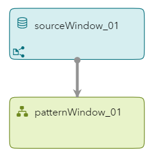
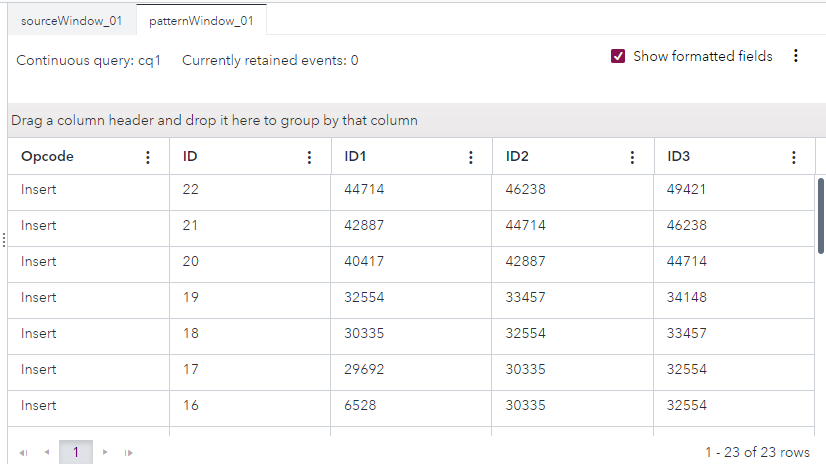

# Using Lua to Identify Trading Patterns in a Stock Market
## Overview
This example demonstrates how to use a Lua-based Pattern window. The model identifies increases in a stock's price within a specific time interval.

---
**NOTE:**
Use this example with SAS Event Stream Processing 2024.03 and later. 

---

For more information about how to install and use example projects, see [Using the Examples](https://github.com/sassoftware/esp-studio-examples#using-the-examples).

## Source Data
The file [stocktrades.csv](stocktrades.csv) contains stock trade data.

## Workflow
The following figure shows the diagram of the project:



The model is stateless, that is, the index on the Source window has the type pi_EMPTY. Events are not retained in any window, and are transformed or passed through. This prevents the Pattern window from growing infinitely.

### sourceWindow_01

Stock trades from the `stocktrades.csv` file enter the model in this Source window.

Explore the settings for this window:
1. Open the project in SAS Event Stream Processing Studio and select the sourceWindow_01 window. 
2. In the right pane, expand **State and Event Type**. Observe the following settings:
   - The **Window state and index** field is set to **Stateless (pi_EMPTY)**. This index does not store events.
   - The **Accept only “Insert” events** check box is selected. If a Source window precedes a Pattern window, the Source window must be specified as insert-only. This causes the Source window to reject any events with an opcode other than Insert, and permits an index type of pi_EMPTY to be used.
3. To examine the window's output schema, on the right toolbar, click . Observe the following fields: 
   - `ID`: This field is the stock trade's ID, which is also selected as the key field.
   - `symbol`: This field is the stock symbol. A stock symbol is a series of letters that are assigned to a security for trading purposes.
   - `currency`: This field identifies the stock trade's currency.
   - `udate`: This field is a date. This field is present in the input data but is not used. This field is included in the output schema for completeness.
   - `msecs`: This field is a time. This field is present in the input data but is not used. This field is included in the output schema for completeness.
   - `price`: This field is the stock price.
   - `quant`: This field is the quantity of stock that is traded.
   - `venue`: This field is the stock exchange at which the stock is traded.
   - `broker`: This field is the stock broker.
   - `buyer`: This field is the buyer of the stock.
   - `seller`: This field is the seller of the stock.
   - `buysellflg`: This field is a flag that indicates whether the trade involves buying or selling stock.
   - `trade_time`: This field is the stock trade's timestamp.
4. Click . 

### patternWindow_01

Stock trade patterns are matched in this Pattern window. 

Pattern windows are insert-only with respect to both their input windows and the output that they produce. As the input and output of a Pattern window are unbounded and insert-only, they are typically stateless windows (that is, windows with index type pi_EMPTY).

The patternWindow_01 window uses Lua code to define the events of interest (EOI) to be matched. The pattern consists of the following events of interest:
- Event 1: Occurrences of the stock symbol GMTC
- Event 2: Re-occurrences of the stock symbol GMTC where the price and quantity of the stock has gone up 50% compared to event 1
- Event 3: Re-occurrences of the stock symbol GMTC where the price and quantity of the stock has gone up 50% compared to event 2

In order for the pattern to be matched, all events of interest must occur within 200 milliseconds of each other.

Explore the settings for this window:
1. In the right pane, expand **Patterns**.
2. In the table in the **Patterns** section, select the `pattern1` row and click . <br>The Edit Pattern window is displayed, which enables you to view the pattern’s properties. The Edit Pattern window is a wizard with four pages.
3. On the **Initialize** page, observe the following settings:
     - In the **Index fields** field, the `symbol` field is selected. This field is part of the sourceWindow_01 window and forms an index generation function. All incoming events are grouped by the specified index. Specifying the `symbol` field as the index field means that the code on the **Lua Code** page does not need to specify this field in each Lua function.
     - The `trade_time` field is specified as the time field. This field is used to derive the time interval that is specified on the **Logic Expression** page of the wizard. If a time field is not specified, system time is used.
4. Click **Next**.
5. On the **Lua Code** page, view the code that specifies the EOI functions and an output function that are required for the pattern:
   
    <table>
    <tr>
    <th>Step</th> <th>Lua Code Section</th>
    </tr>
    <tr>
    <td>The first EOI function, f1, identifies occurrences of the stock symbol GMTC.</td>
    <td>


    ```
    function f1(event,context)
      if (event.symbol=="GMTC") then
        return true,{p0=event.price,q0=event.quant}
      end

      return false
    end
    ```


    </td>
    </tr>
    <tr>
    <td>The second EOI function, f2, identifies re-occurrences of the stock symbol GMTC where the price and quantity of the stock has gone up 50% compared to events identified by f1.</td>
    <td>

      
    ```
    function f2(event,context)
      if (context.data.p0<event.price*1.5 and 
      context.data.q0<event.quant*1.5)
      then
        return true,{p1=event.price,q1=event.quant}
      end

      return false
    end
    ```

      
    </td>
    </tr>
    <tr>
    <td> The third EOI function, f3, identifies re-occurrences of the stock symbol GMTC where the price and quantity of the stock has gone up 50% compared to events identified by f2.</td>
    <td>


    ```
    function f3(event,context)
      return context.data.p1<event.price*1.5 
      and context.data.q1<event.quant*1.5
    end
    ```


    </td>
    </tr>
    <tr>
    <td>The output function, called output, assigns unique IDs to returned events and injects them into the event stream. The output function references output fields called ID1, ID2, and ID3, which are specified in the project's output schema.</td>
    <td>


    ```
    function output(context)--4
      local   event = {}
      event.ID1 = context.events.e1.ID
      event.ID2 = context.events.e2.ID
      event.ID3 = context.events.e3.ID
      return event
    end
    ```


    </td>
    </tr>
    </table>

7. Click **Next**.
8. On the **Output and Events** page, observe the following settings:
     - The **Output function** field is set to `output`. This output function is defined on the **Lua Code** page.
     - The pattern contains three EOIs. The event `e1` is associated with the EOI function `f1`. The event `e2` is associated with the EOI function `f2`. The event `e3` is associated with the EOI function `f3`.The EOI functions are defined on the **Lua Code** page.
     - In this example, the Included Fields and Send Events columns are empty.
       - When the Included Fields column is empty, all Lua fields are passed to the event. When you select Lua fields in the Included Fields column, only those fields are passed to the event.
       - Selecting a check box in the Send Events column sends all previously matched events into the Lua function. It can be more efficient to not send all events into the function. The code that is specified in the **Lua Code** section window can put data into the pattern context. In that case, access to previous events is not needed when you define events.
9. Click **Next**.
10. On the **Logic Expression** page, observe that the pattern contains the following logic expression: `fby{200 milliseconds}(e1, e2, e3)`<br>This logic expression specifies that `e1` must occur to start a timer. Then `e2`, followed by `e3`, must occur within 200 milliseconds of `e1`. The time is based on the `trade_time` field, rather than system time, because this field was specified as the pattern's time field on the **Initialize** page.<br>The logic expression does not use the Lua language.

## Test the Project and View the Results

If you do not use the **Install example** button in SAS Event Stream Processing Studio, note that if you use the **Publish** button to publish events from the `stocktrades.csv` file into the sourceWindow_01 window, you must specify the following date format: `%Y-%m-%d %H:%M:%S`. For more information, see [Publish Events from a CSV file](https://go.documentation.sas.com/doc/en/espcdc/default/espstudio/p124n2fohetwqzn109gsdel6o1cj.htm).

When you test the project, the results for each window appear on separate tabs.
- The **sourceWindow_01** tab lists the stock trades that are received from the input file.
- The **patternWindow_01** tab lists the matched patterns. After a while, a total of 23 rows appear in this tab.

The following figure shows the results for the patternWindow01 tab:



You might see warnings in the Log pane about the sourceWindow_01 window being throttled. You can ignore these warnings.

## Additional Resources
For more information, see [SAS Help Center: Using Lua in a Pattern Window](https://documentation.sas.com/?cdcId=espcdc&cdcVersion=default&docsetId=espcreatewindows&docsetTarget=n1rj6nmwuzuxisn12tjeu0o336tt.htm#n18zvo8e3r6y9fn1i5twt2mxease).
