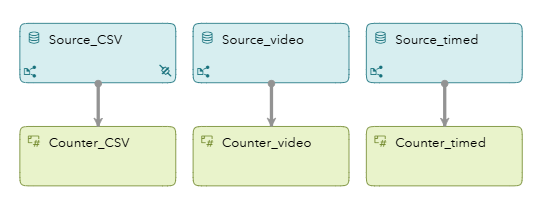
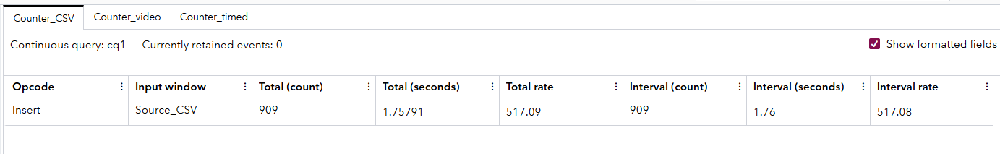
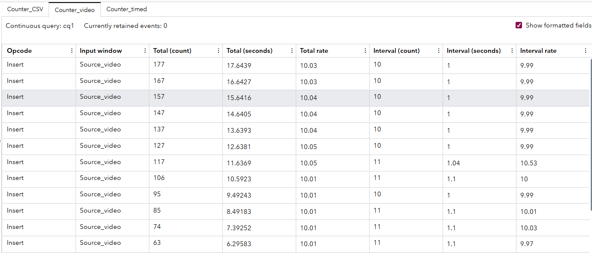
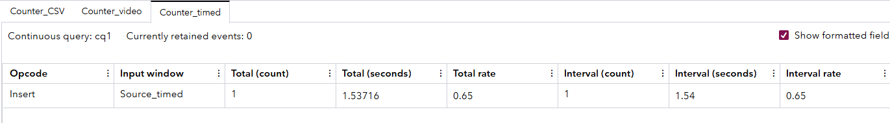

## **Overview**

This SAS Event Stream Processing (ESP) project demonstrates the use of the **counter window**, a simple but powerful analytic tool used to **track the number of events** passing through a data stream. The project showcases three different types of source connectors—CSV file, video input, and timed data stream—and pairs each with a corresponding counter window to monitor throughput.

**Why use the counter window?**
 The counter window is ideal for observing data flow rates, detecting anomalies (e.g., data dropouts or surges), and measuring performance. It’s commonly used in monitoring, debugging, and benchmarking real-time event pipelines.

------

## **Source Data**

This project has three source windows, each illustrating a different kind of input:

- **Source_CSV**: Ingests location data from a CSV file using a file system connector. The schema includes a timestamped key along with latitude and longitude coordinates.
- **Source_video**: Uses a videocap connector to input video frames from a sample video file. Each frame is treated as an event, with an id and image blob.
- **Source_timed**: Uses a timer connector to emit synthetic events at fixed intervals. Each event includes an id, timestamp (time), and label.

These sources simulate a realistic multi-modal streaming scenario, ideal for performance monitoring.

------

## **Workflow**

The workflow consists of the following windows:

	

Each source window feeds directly into its corresponding counter window. These counter windows increment a count each time they receive a new event from their upstream source. This provides a clear and real-time metric of how many events have passed through each stream.

This setup allows direct comparison of data flow behavior across different source types.

------

## **Test the Project and View the Results**

When you test the project, the results for each window appear on separate tabs.  One of the key takeaways from this project is how **event volume**—and therefore counter output—varies significantly depending on the **source window type and connector configuration**. Here’s how each behaves:

####  **CSV Source with File Connector**

- The Source_CSV window reads a file containing many rows of data.

- When using an **unrestricted file connector** (e.g., repeatcount without throttling), it can **emit hundreds or thousands of events very quickly**.

- As a result, the Counter_CSV window often shows **the highest count** in the shortest time.

- This makes it ideal for stress testing or measuring batch ingestion rates.

  

####  **Video Source with VideoCap Connector**

- The Source_video window reads a video file and emits **one event per frame**, based on the inputrate and blocksize.

- In this case, the video connector is configured to emit at **10 frames per second**.

- As a result, the Counter_video window reflects a **moderate and consistent stream of events**.

- The count increases steadily but more slowly than the CSV source.

  

#### **Timed Source with Timer Connector**

- The Source_timed window is designed to emit **one event every 60 seconds** using the timer connector.
- This makes it by far the **slowest** source in terms of event generation.
- Accordingly, Counter_timed increases **very gradually**, making it useful for low-rate event simulation and benchmarking long-running processes.

### **Why This Matters**

Understanding these differences is critical for:

- **Debugging**: Quickly identifying why one stream might be lagging behind others.
- **System Benchmarking**: Measuring throughput under various conditions.
- **Alerting/Monitoring**: Using thresholds in counter outputs to detect data gaps or bursts in production systems.

By comparing the **event rates across the counter windows**, this project gives clear visibility into how different source types affect the overall streaming pipeline performance.

## **Additional Resources**

For more information on the counter window and how to configure it, refer to the official SAS documentation:

📘 [SAS ESP Counter Window Documentation](https://go.documentation.sas.com/doc/en/espcdc/v_062/espcreatewindows/titlepage.htm)

### Video Credits and Copyright

| File Name          | Copyright                                      | Notes                                        |
| ------------------ | ---------------------------------------------- | -------------------------------------------- |
| `intersection.mp4` | © 2024 SAS Institute Inc. All Rights Reserved. | To be used only in the context of this demo. |

### Video and Image Restrictions

The videos and images provided in this example are to be used only with the project provided. Using or altering these videos and images beyond the example for any other purpose is prohibited.
