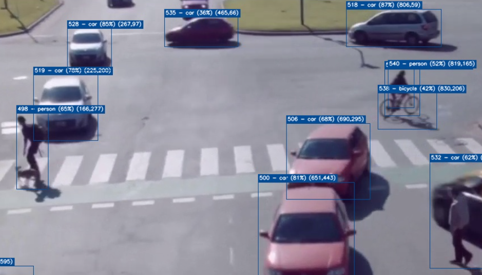
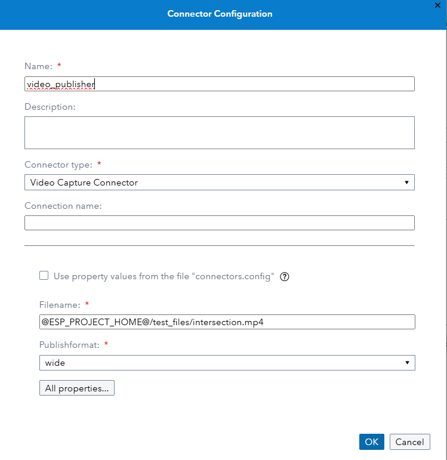
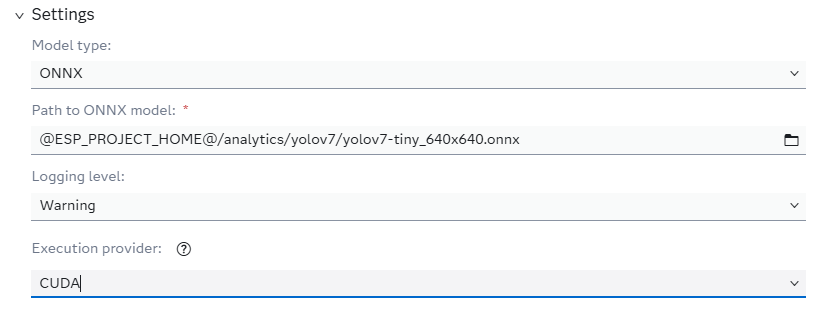
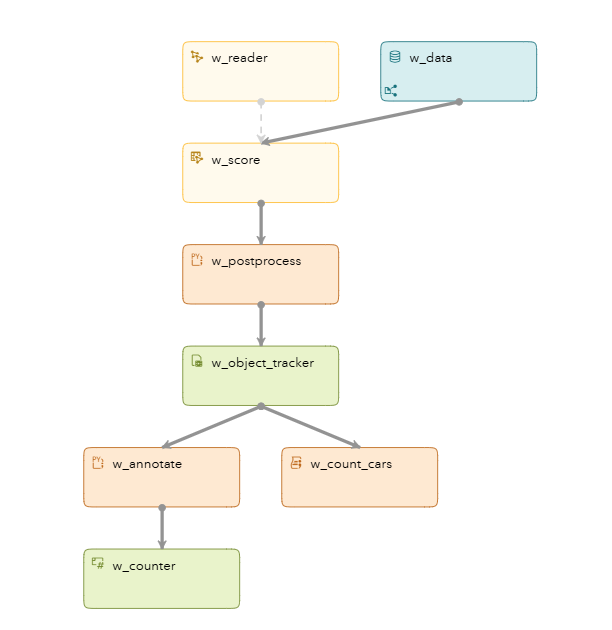
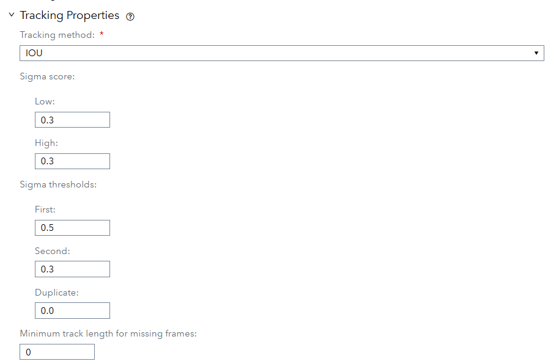
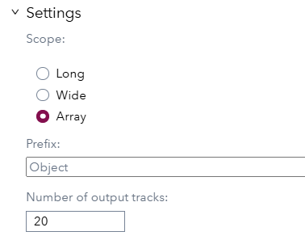
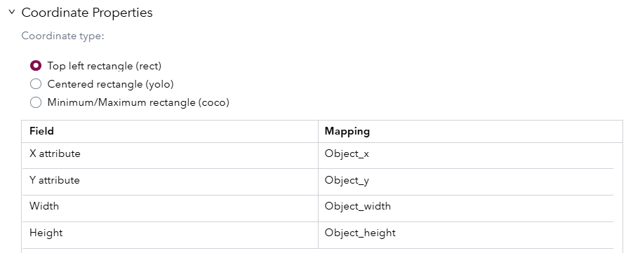
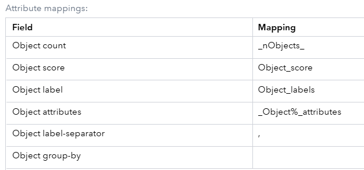
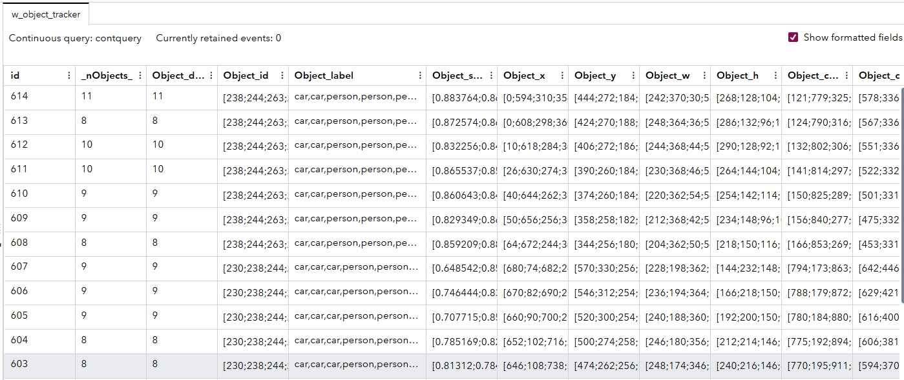
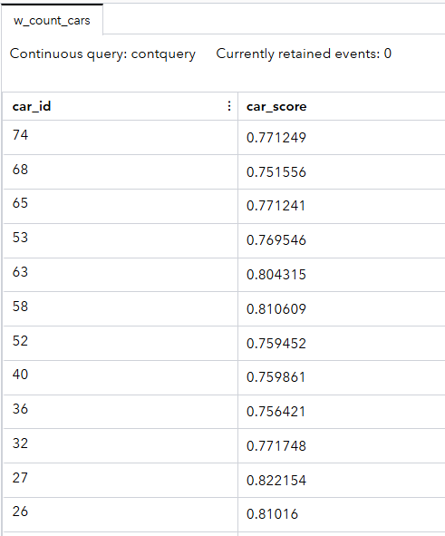

## **SAS ESP Project: Object Tracker Window – Vehicle Counting at an Intersection**

### **Overview**

In this SAS Event Stream Processing (ESP) project, the goal is to analyze video from a busy intersection and count how many **unique cars** cross through the frame. To achieve this, the project uses the **Object Tracker window**, which plays a critical role in distinguishing whether a car has already been counted or is new to the scene. This prevents duplicate counts even though the model runs at 10 frames per second.

The **Object Tracker window** in SAS ESP enables the continuous **tracking of objects across multiple frames**. Instead of treating every detection as a new object, the window uses a configured tracking algorithm (in this case, IOU – Intersection Over Union) to maintain the **identity of each object over time**. This is essential in real-world streaming analytics scenarios such as traffic monitoring, where miscounting objects can lead to incorrect results.

------

### **Source Data**

	

The source data is a **video file** showing an intersection with frequent vehicle traffic. This video is published into ESP at a rate of **10 frames per second** using the videocap connector.

Each event entering the system includes:

- A unique **id**
- A single frame represented as a binary large object (blob) in the image field

	

This frame data is passed through the model pipeline for object detection and tracking.

------

### **Workflow**

Here's a summary of how the windows work together:

	

1. **w_data (Source Window)**
    Ingests video frames from the intersection and publishes them into ESP.

2. **w_reader (Model Reader Window)**
    Loads and pre-processes the YOLOv7-tiny object detection model (ONNX format), resizing and normalizing the image for scoring.

3. **w_score (Score Window)**
    Runs inference on each frame using the loaded ONNX model and outputs bounding box tensors.

4. **w_postprocess (Python Window)**
    Converts model tensor output into readable object fields such as Object_x, Object_y, Object_labels, etc. Includes detected bounding boxes, class labels, and confidence scores.

5. **w_object_tracker (Object Tracker Window)**
   **Tracks detected objects across multiple frames**, assigning a consistent Object_id to each object.

   - Uses the **IOU (Intersection Over Union)** method for tracking.
   - Ensures a car appearing in multiple frames is recognized as the *same* car.
   - Filters out noisy or short-lived tracks.

   **Why use it?**
    Without object tracking, a car detected in 30 different frames might be counted 30 times. With tracking, we get a **stable ID for each car**, so it is counted only once.

6. **w_count_cars (Lua Window)**
   Filters the object stream:

   - Only cars (label == car)
   - Confidence > 75%
   - Sum total count of cars only. 
   
7. **w_annotate (Python Window)**
    Annotates frames with bounding boxes and object IDs for visualization.

8. **w_counter (Counter Window)**

9. Serves as a performance indicator or summary statistic sink.

### **Object Tracker Window Configuration (Detailed)**

The **w_object_tracker** window is configured to use the **IOU (Intersection Over Union)** method to associate objects across frames. This window is responsible for assigning persistent IDs to detected objects (like cars) as they move across video frames, even if they're only partially visible or momentarily obscured.

Below is a breakdown of the specific parameters used and what they do:

#### **Tracker Method:**

	

- **method="iou"**: Uses bounding box overlap (IOU) to match detections from one frame to the next. This is a standard method for object tracking when object re-identification isn't available.

------

#### **Key Parameters Used:**

| Parameter                     | Description                                                  |
| ----------------------------- | ------------------------------------------------------------ |
| `score-sigma-low="0.3"`       | Minimum confidence score threshold to start tracking an object. Helps filter out low-confidence detections. |
| `score-sigma-high="0.3"`      | Confidence threshold to continue tracking an existing object. Objects falling below this may be dropped. |
| `iou-sigma="0.5"`             | IOU threshold for associating a new detection with an existing track. A value of 0.5 means at least 50% overlap is required. |
| `iou-sigma2="0.3"`            | Secondary IOU threshold used in resolving multiple associations. Typically lower than `iou-sigma`. |
| `iou-sigma-dup="0.0"`         | IOU threshold for duplicate suppression. Set to 0.0 to aggressively suppress duplicate tracks. |
| `velocity-vector-frames="15"` | Number of frames used to estimate object velocity for better association across frames. |
| `max-track-lives="10"`        | Number of frames an object can persist without being matched. Allows brief occlusions. |
| `min-track-length="0"`        | Minimum number of frames a track must exist before being output. 0 means emit immediately. |
| `track-retention="0"`         | Time in seconds to keep inactive tracks in memory. 0 disables retention. |

------

#### **Output Configuration:**

	

- **mode="array"**: Outputs tracked objects as arrays (so we can batch multiple objects per frame).
- **tracks="20"**: Maximum number of objects that can be tracked simultaneously. Tune based on scene complexity.

------

#### **Input Mapping Configuration:**

	

- **count**: _nObjects_ — number of detected objects per frame.
- **score**: Confidence score per object (Object_score).
- **label**: Comma-separated list of labels (Object_labels).
- **x, y, width, height**: Bounding box coordinates for each object, used for IOU calculation.
- **coord-type="rect"**: Specifies rectangular bounding boxes.
- **attributes**: (Optional) additional attributes per object, not used in this example but available if needed.

------

#### **How It Works Together**

Each time a frame passes through:

- The tracker looks at the current set of detected objects.
- It compares them with previously tracked objects using IOU overlap.
- If the overlap is high enough and the scores meet thresholds, it assigns or maintains an Object_id.
- That ID is used downstream in the Lua window (w_count_cars) to ensure **cars are only counted once**.

------

### **Test the Project and View the Results**

When you test the project, the results for each window appear on separate tabs.  We selected array style output so each frame that is scored represents one line of output.   For example the event with id 614 detected 11 objects.  Each numerical output is represented by an array of data while string data, Object_label, is represented as a comma delimited string.  

The Lua window is used to filter the results and only list car ids excluding all other types of objects that are detected such as people or bikes.   Cars with a confidence below 75% are also excluded.  

	

------

### **Additional Resources**

For full documentation on the **Object Tracker window**, including algorithm choices, parameters, and usage, visit the official SAS ESP documentation:  [Using Object Tracker Windows](https://go.documentation.sas.com/doc/en/espcdc/v_057/espcreatewindows/titlepage.htm)

For more information about how to explore and test this project, see [Using the Examples](https://github.com/sassoftware/esp-studio-examples#using-the-examples).
